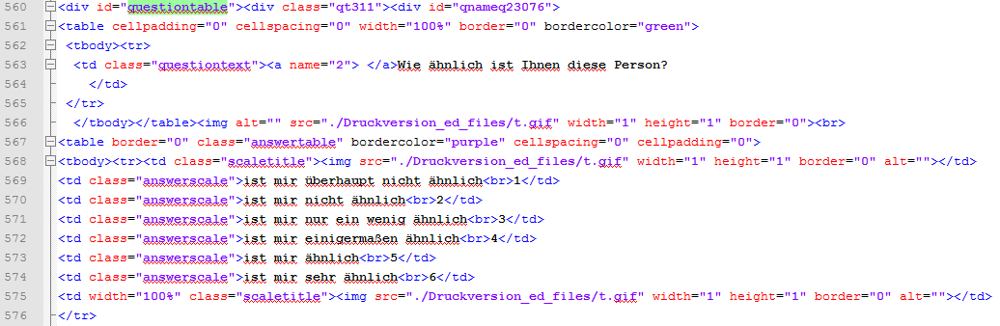

```{r setup, include=FALSE}
knitr::opts_chunk$set(echo = FALSE)
library(knitr)
```

## Biographie

- VWL Studium in Trier (Diplom 2008)
- 2004 Erasmus Jahr an der Université Jean Moulin in Lyon
- Wissenschaftlicher Mitarbeiter am [Lehrstuhl für Wirtschafts- und Sozialstatistik](https://www.uni-trier.de/index.php?id=35894)
- 2012 Promotion (Thema: Die Erzeugung von synthetischen Grundgesamtheiten)
- Seit 2012 am Gesis Leibnitz Institut für Sozialwissenschaften - zunächst Team Statistik
- Seit 2017 Survey Statistik im Team Gesis Panel

## Das Gesis Institut

### Fünf wissenschaftliche Abteilungen

- Datenarchiv für Sozialwissenschaften (DAS)
- Dauerbeobachtung der Gesellschaft (DBG)
- Computational Social Siences (CSS)
- Survey Design and Methodology (SDM)
- Wissenstechnologien für Sozialwissenschaften (WTS)


## Das Gesis Institut II

### Gesis ist:

- Infrastruktureinrichtung für die Sozialwissenschaften
- mit über 250 MitarbeiterInnen an zwei Standorten (Köln und Mannheim)

### GESIS bietet:

- Beratung zu Forschungsprojekten in allen Phasen
- Forschungsbasierte wissenschaftliche Dienstleistungen

## Datenerhebungsinfrastruktur für die Profession

- Probabilistisches mixed-mode Access Panel
- Deutsche Allgemeinbevölkerung
  - Deutschsprachig - ab 18 Jahren
  - Basierend auf Einwohnermeldeamtsstichprobe
- Mehrstufiger Rekrutierungsprozess, sequentielles mixed-mode Design
- Initiale Rekrutierung 2013 
- 2016 Auffrischungsstichprobe

## Studien im Gesis Panel

```{r,echo=F}
(load("data/GP_spat_studies.RData"))
colnames(tab_spatial)[1] <- "Kürzel"
kable(tab_spatial)
```

## Datenaufbereitung

- Panelbereinigung (bei Abmeldung oder Nonresponse)
- Anonymisierung und Kategorisierung
- Filterführung muss sich in den Missings wiederspiegeln


## [R in meinem Arbeitsalltag](https://support.rstudio.com/hc/en-us/articles/201057987-Quick-list-of-useful-R-packages)

- `foreign`, `readstata13` und `xlsx` zum Import von Daten
- `dplyr` Paket zur Datenaufbereitung
- `doParallel` zur Bearbeitung vieler Jobs
- `Rmarkdown` bei der Datendokumentation (Codebook, Wave Report) 
- Rstudio git Interface zur Versionskontrolle


## Arbeiten mit HTML Daten

- [Cheatsheet zum Umgang mit Strings](file:///D:/Eigene%20Dateien/Downloads/strings.pdf)




