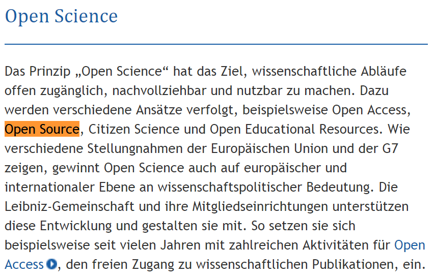
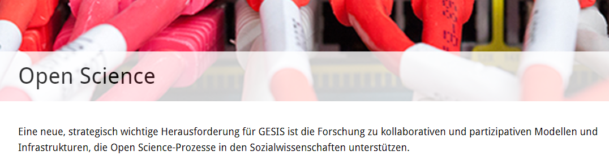

```{r setup, include=FALSE}
knitr::opts_chunk$set(echo = FALSE)
```

## [Welche Programm werden genutzt](http://blog.revolutionanalytics.com/2013/10/r-usage-skyrocketing-rexer-poll.html)


## [Trend Open Science - Leibniz Gemeinschaft](https://www.leibniz-gemeinschaft.de/forschung/open-science/)



## [Trend Open Science - GESIS](https://www.gesis.org/forschung/angewandte-informatik/open-science/)




## [Job trends ](http://blog.revolutionanalytics.com/2017/02/job-trends-for-r-and-python.html)


## Fazit - Zukunft von R in der Wissenschaft

- Bedeutung von R scheint zuzunehmen
- Open Science Entwicklung
- Stata ist nach wie vor wichtig (Pfadabhängigkeit)
- Bedeutung von SPSS nimmt ab


<!--
http://sharpsightlabs.com/blog/r-recommend-data-science/

http://r4stats.com/articles/popularity/

https://www.kdnuggets.com/2013/12/poll-results-r-leading-python-gaining.html
-->