```{r, include=FALSE}
knitr::opts_chunk$set(echo = TRUE,cache=T,warning=F,message=FALSE)
par(mai=c(0,0,0,0))
log_gesis=F
log_home=!log_gesis
  
internet=F
noint = !internet
```


# Motivation - [Deutschlands größte Klimasünder](http://www.spiegel.de/wissenschaft/mensch/deutschland-das-sind-die-groessten-klimasuender-a-1178207.html)

- Spiegel Artikel am 16.11.2017 aus Anlass der Jamaika Gespräche

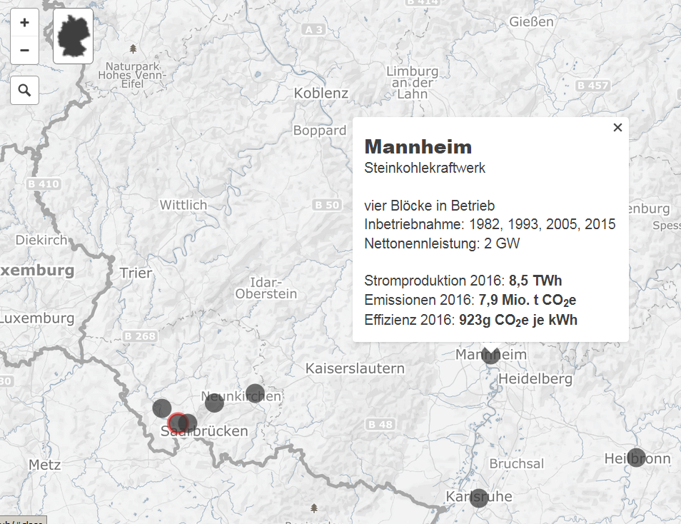


# Gliederung

- Quellen für Polygonzüge (Staaten, Gemeinden, PLZ Bereiche etc.)
- Quellen für inhaltliche Daten
- Pakete zur Erstellung thematischer Karten (bspw. Pakete `maptools`, `sp`, `tmap`)
- Verknüpfung von Daten
- Beispiele für die Darstellung in Karten
 
<!--
Beim letzten Punkt colour Picker einbauen - Folien maps
-->

```{r,echo=F,eval=F}
install.packages("knitr")
install.packages("sp")
install.packages("tmap")
install.packages("choroplethr")
install.packages("choroplethrMaps")
install.packages("acs")
install.packages("rJava")
install.packages("xlsxjars")
install.packages("xlsx")
```


```{r,echo=F}
library(knitr)
```

```{r,echo=F,eval=F}
setwd("~/GitHub/GeoData/presentations/ps_user_stuttgart")
purl("ps_user_stuttgart_part3.Rmd")
```


```{r,eval=F,echo=F}
setwd("D:/Daten/GitHub/GeoData/presentations/ps_user_stuttgart")
purl("ps_user_stuttgart_part3.Rmd")
```


# Quellen für Polygonzüge


# Hello World

```{r}
library(maps)
map()
```


# Das Paket `maps` - etwas detailierter


Grenzen sind recht grob:

```{r}
map("world", "Germany")
```


<!--
Die Befehle im Paket maps sind etwas anders als bei den anderen Paketen.
-->

# Das Paket `maps` - Mehr Information

- Nur für manche Staaten bekommt man Umkreise für Einheiten unterhalb der Staatsgrenze (bspw. Frankreich, USA). 

```{r}
data(world.cities)
map("france")
map.cities(world.cities,col="blue")
```


# Das Paket `maptools`

- Das Paket `maptools` hat intuitivere Bedienung, zudem können Shapefiles verarbeitet werden.

```{r}
library(maptools)
data(wrld_simpl)
plot(wrld_simpl,col="royalblue")
```

# Was sind shapefiles (`.shp`)?

- Das Dateiformat Shapefile ist ein ursprünglich für die Software ArcView der Firma ESRI entwickeltes Format für Geodaten. (Quelle: [Wikipedia](https://de.wikipedia.org/wiki/Shapefile))

```{r,eval=F}
head(wrld_simpl@data)
```

```{r,echo=F,eval=noint}
kable(head(wrld_simpl@data))
```

```{r,echo=F,eval=internet}
library(DT)
datatable(wrld_simpl@data)
```


```{r}
length(wrld_simpl)
nrow(wrld_simpl@data)
```

# Einzelne Elemente des Datensatzes plotten

```{r}
ind <- which(wrld_simpl$ISO3=="DEU")
```

```{r}
plot(wrld_simpl[ind,])
```

```{r}
wrld_simpl@data[ind,]
```


# Das R-Paket `choroplethrMaps`

```{r}
library(ggplot2)
library(choroplethrMaps)
data(country.map)
ggplot(country.map, aes(long, lat, group=group)) + geom_polygon()
```

# Eine Karte für die USA

```{r}
data(state.map)
ggplot(state.map,aes(long,lat,group=group))+geom_polygon()
```

# Andere Quellen für Shapefiles - Das Paket `raster`

- Für Polygonzüge unterhalb der Staatsgrenzen ist [Global Administrative Boundaries](http://www.gadm.org/) eine gute Quelle.
- Vor allem weil es auch eine API gibt, die man mit dem Paket `raster` nutzen kann.

```{r,warning=F}
library(raster)
LUX1 <- getData('GADM', country='LUX', level=1)
plot(LUX1)
```

# Daten für das Luxemburg Beispiel

```{r,eval=F}
head(LUX1@data)
```


```{r,eval=noint,echo=F}
kable(head(LUX1@data))
```

```{r,eval=internet,echo=F}
datatable(LUX1@data)
```


# [Shapefiles bei Eurostat](http://ec.europa.eu/eurostat/de/web/gisco/geodata/reference-data/administrative-units-statistical-units)

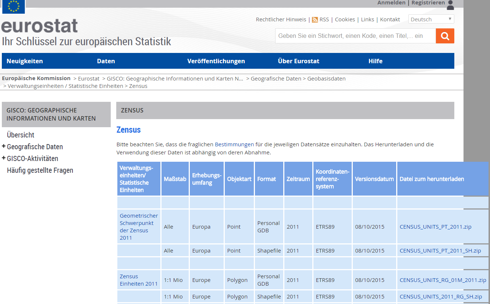


# BKG - Quelle für Kreise in Deutschland

- Umrisse von 402 Kreisen in Deutschland
- Quelle: [Bundesamt für Kartographie und Geodäsie](http://www.geodatenzentrum.de/geodaten/gdz_rahmen.gdz_div?gdz_spr=deu&gdz_akt_zeile=5&gdz_anz_zeile=1&gdz_unt_zeile=15&gdz_user_id=0) (BKG)
- Karten gibt es auch für Bundesländer und Gemeinden


```{r,eval=F}
library(maptools)
krs <- readShapePoly("vg250_ebenen/vg250_krs.shp")
plot(krs)
```

```{r,echo=F,eval=log_gesis}
library(maptools)
krs <- readShapePoly("D:/Daten/Daten/GeoDaten/vg250_ebenen/vg250_krs.shp")
```

```{r,echo=F}
library(DT)
```

```{r,echo=F,eval=F}
datatable(krs@data)
```

```{r}
head(krs@data$RS)
```

# Die Kreise für Baden-Württemberg

- Systematik hinter dem Amtlichen Gemeindeschlüssel (AGS) bzw. Regionalschlüssel (RS) bei [Wikipedia](https://de.wikipedia.org/wiki/Amtlicher_Gemeindeschl%C3%BCssel)

```{r}
BLA <- substr(krs@data$RS,1,2)
plot(krs[BLA=="08",])
```

# [Shapefiles für Wahlkreise](https://www.bundeswahlleiter.de/bundestagswahlen/2017/wahlkreiseinteilung/downloads.html)


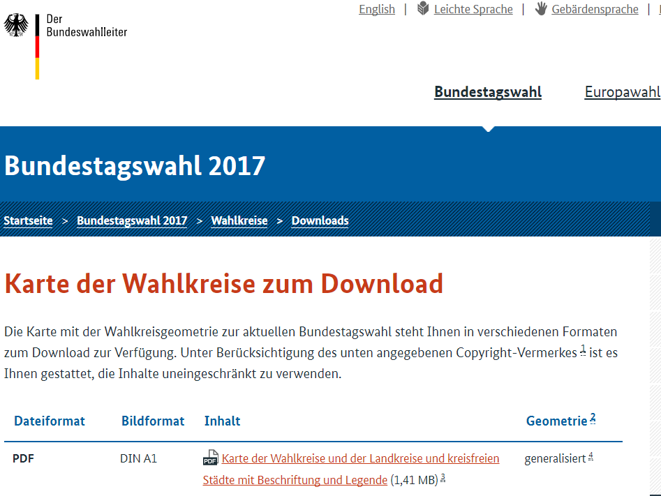


# Ortsnetzbereiche

Quelle: [Bundesnetzagentur](https://www.bundesnetzagentur.de/DE/Sachgebiete/Telekommunikation/Unternehmen_Institutionen/Nummerierung/Rufnummern/ONRufnr/ON_Einteilung_ONB/ON_ONB_ONKz_ONBGrenzen_Basepage.html)

<!-- 
ggf. noch mal neu herunterladen

https://www.bundesnetzagentur.de/SharedDocs/Downloads/DE/Sachgebiete/Telekommunikation/Unternehmen_Institutionen/Nummerierung/Rufnummern/ONVerzeichnisse/ONBGrenzen/ONB-Grenzen-2017.zip;jsessionid=E4247BF20DD015E0722196351E0DC163?__blob=publicationFile&v=14
--> 

```{r,echo=F,eval=log_gesis}
setwd("D:/Daten/Daten/GeoDaten/")
```

```{r,echo=F,eval=log_home}
setwd("D:/GESIS/Vorträge/20171122_userStuttgart/data/")
```


```{r,eval=F,echo=F}
install.packages("maptools")
```


```{r,eval=log_gesis,echo=F}
library(maptools)
setwd("D:/Daten/Daten/GeoDaten/")
onb <- readShapePoly("onb_grenzen.shp")
```

```{r,eval=log_home,echo=F}
library(maptools)
setwd("D:/GESIS/Vorträge/20171122_userStuttgart/data/")
onb <- readShapePoly("ONB_BnetzA_DHDN_Gauss3d-3.shp")
```


```{r,eval=F}
onb <- readShapePoly("onb_grenzen.shp")
```

```{r,eval=F}
head(onb@data)
```

```{r,eval=noint,echo=F}
kable(head(onb@data))
```

```{r,eval=internet,echo=F}
datatable(onb@data)
```

# Karte der Vorwahlbereiche


# Einen größeren Vorwahlbereich ausschneiden

```{r,eval=log_gesis}
vwb <- as.character(onb@data$VORWAHL)
vwb1 <- substr(vwb, 1,2)
vwb7 <- onb[vwb1=="07",]
plot(vwb7)
```

```{r,eval=log_home}
vwb <- as.character(onb@data$ONB_NUMMER)
vwb1 <- substr(vwb, 1,1)
vwb7 <- onb[vwb1=="7",]
plot(vwb7)
```


# Das Paket `rgdal`

- Postleitzahlenbereiche - <http://arnulf.us/PLZ>

```{r}
library(rgdal)
```


```{r,eval=log_gesis,echo=F}
setwd("D:/Daten/Daten/GeoDaten")
PLZ <- readOGR ("post_pl.shp","post_pl")
```

```{r,eval=log_home,echo=F}
setwd("D:/GESIS/Workshops/GeoDaten/data/")
PLZ <- readOGR ("post_pl.shp","post_pl")
```


```{r,eval=F}
library(rgdal)
PLZ <- readOGR ("post_pl.shp","post_pl")
```

# PLZ-Bereiche in Stuttgart

```{r}
SG <- PLZ[PLZ@data$PLZORT99=="Stuttgart",]
plot(SG,col="chocolate1")
```

# PLZ-Bereiche in Berlin

```{r}
BE <- PLZ[PLZ@data$PLZORT99%in%c("Berlin-West","Berlin (östl. Stadtbezirke)"),]
plot(BE,col="chocolate2",border="lightgray")
```

<!--
# Die Grenzen anders einfärben
https://gis.stackexchange.com/questions/36877/how-do-i-change-the-polygon-fill-color-and-border-color-for-spatialpolygons-obje
-->

# Zwischenfazit - Quellen für Polygonzüge

- In einigen R-Paketen sind Polygonzüge hinterlegt
- Umgang mit den Daten unterscheidet sich
- Am sinnvollsten ist das arbeiten mit Shapefiles (.shp)
- Neben den R-Paketen gibt es zahlreiche weitere Quellen für Polygonzüge.

# Thematische Karten mit R erstellen

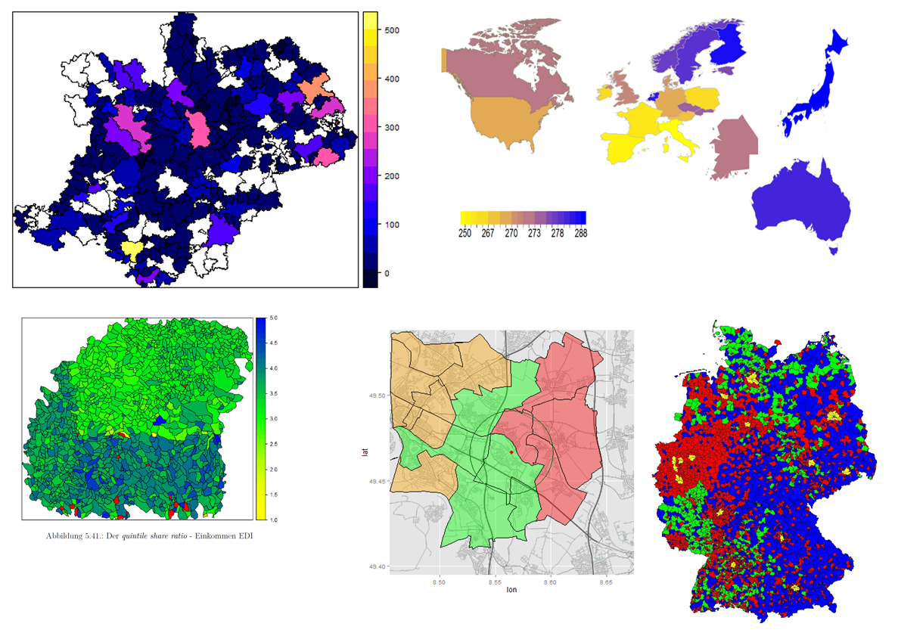

# Thematische Karten erzeugen - das Paket `sp`

```{r}
library(sp)
spplot(wrld_simpl,"POP2005")
```

# Andere Einfärbungen wählen - Das Paket `colorRamps`

```{r,eval=F,echo=F}
install.packages("colorRamps")
```

```{r}
library(colorRamps)
spplot(wrld_simpl,"POP2005",col.regions=blue2red(100))
```

# Es gibt auch noch mehr Farbverläufe im Paket `colorRamps`

- `blue2green`, `blue2yellow`

```{r}
spplot(wrld_simpl,"POP2005",col.regions=matlab.like(100))
```

# Thematische Karten mit dem Paket `choroplethr`

```{r}
library(choroplethr)
data(df_pop_state)
```

```{r,eval=F}
head(df_pop_state)
```

```{r,echo=F,eval=internet}
datatable(df_pop_state)
```

```{r,echo=F,eval=noint}
kable(head(df_pop_state))
```

# Eine thematische Karte mit `choroplethr` erstellen

```{r}
state_choropleth(df_pop_state)
```


# [Nur drei Staaten darstellen](http://mirrors.softliste.de/cran/web/packages/choroplethr/vignettes/b-state-choropleth.html)

```{r}
state_choropleth(df_pop_state,
                 title      = "2012 Population Estimates",
                 legend     = "Population",
                 num_colors = 1,
                 zoom       = c("california", "washington", "oregon"))
```

# Eine Karte der US Counties

```{r}
data(df_pop_county)
county_choropleth(df_pop_county)
```


# [Choroplethen Länder](http://mirrors.softliste.de/cran/web/packages/choroplethr/vignettes/d-country-choropleth.html)

```{r}
data(df_pop_country)
country_choropleth(df_pop_country,
              title      = "2012 Population Estimates",
              legend     = "Population",
              num_colors = 1,
              zoom       = c("austria","germany",
                             "poland", "switzerland"))
```

# Weltbank Daten

```{r}
library(WDI) 
WDI_dat <- WDI(country="all", indicator=c("AG.AGR.TRAC.NO","TM.TAX.TCOM.BC.ZS"),
    start=1990, end=2000)
```

- Es gibt auch eine Funktion `WDIsearch` mit der man nach Indikatoren suchen kann

```{r,eval=F}
head(WDI_dat)
```

```{r,eval=noint,echo=F}
kable(head(WDI_dat))
```

```{r,eval=internet,echo=F}
datatable(WDI_dat)
```

# Weltkarte mit den Weltbank Daten

```{r}
choroplethr_wdi(code="SP.DYN.LE00.IN", year=2012,
                title="2012 Life Expectancy")
```


# Eurostat Daten

Sie können eine Statistik der Sparquote bei [Eurostat](http://ec.europa.eu/eurostat/web/euro-indicators/peeis) downloaden.

<http://ec.europa.eu/eurostat/web/euro-indicators/peeis>

```{r,echo=F,eval=log_gesis}
setwd("J:/Work/Statistik/Kolb/Workshops/2015/Spatial_MA/Folien/dataImport/data/")
```

```{r,eval=T}
library(xlsx)
HHsr <- read.xlsx2("data/HHsavingRate.xls",1)
```

```{r,echo=F,eval=F}
kable(HHsr[1:8,1:6])
```


# [Zensus Ergebnisse](https://www.zensus2011.de/SharedDocs/Aktuelles/Ergebnisse/DemografischeGrunddaten.html)

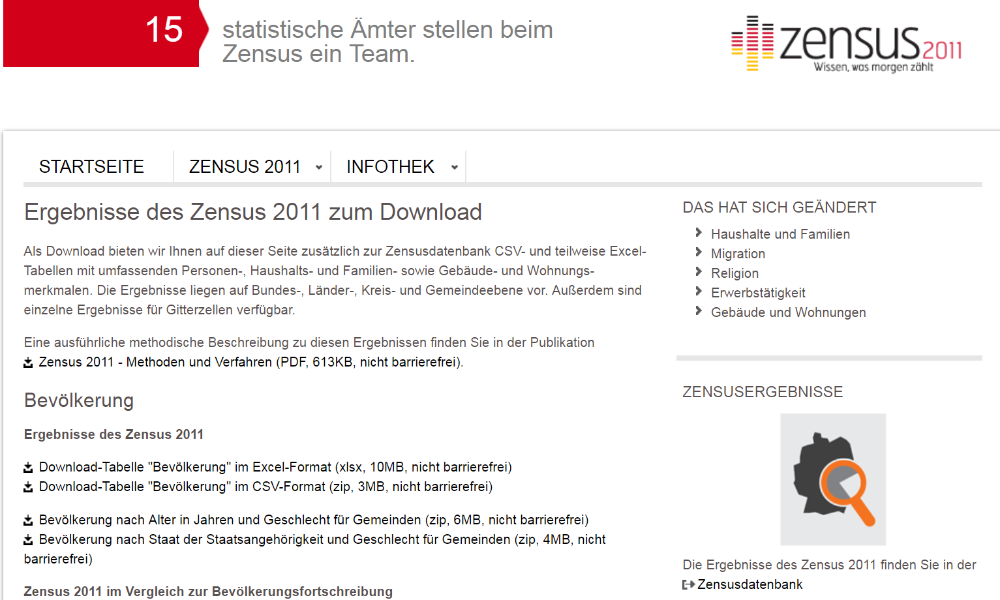


# Zensus Atlas

<https://ergebnisse.zensus2011.de/>


# [Zensus Gemeindeergebnisse](https://www.destatis.de/DE/Methoden/Zensus_/Zensus.html)

```{r,eval=F,echo=F}
library(xlsx)
setwd("D:/GESIS/Vorträge/20171122_userStuttgart/data/")
bev_dat <- read.xlsx("xlsx_Bevoelkerung.xlsx",3)
```


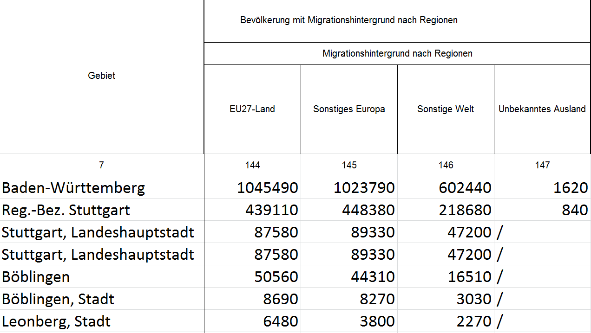

```{r}
zen <- read.csv2("data/Zensus_extract.csv")
# Personen mit eigener Migrationserfahrung
# mit beidseitigem Migrationshintergrund
zen2 <- data.frame(Personen_Mig=zen[,which(zen[9,]==128)],
                   Personen_Mig_bs=zen[,which(zen[9,]==133)])
```


```{r, eval=F,echo=F}
library(knitr)
kable(head(bev_dat))
```


# [datahub.io](datahub.io)

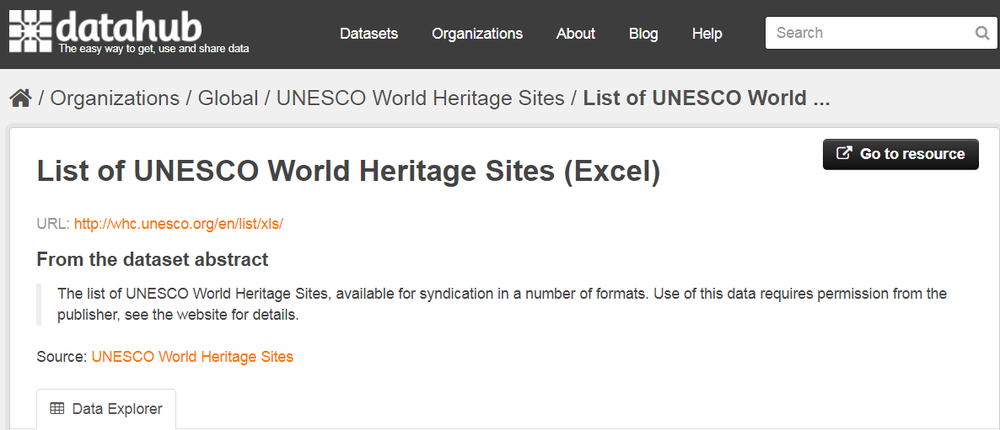

# Weltkulturerbestätten

```{r,eval=F}
url <- "https://raw.githubusercontent.com/Japhilko/
GeoData/master/2015/data/whcSites.csv"

whcSites <- read.csv(url) 
```

```{r,echo=F}
url <- "https://raw.githubusercontent.com/Japhilko/GeoData/master/2015/data/whcSites.csv"

whcSites <- read.csv(url) 
```

```{r,echo=F}
kable(head(whcSites[,c("name_en","date_inscribed","longitude","latitude","area_hectares","category","states_name_fr")]))
```


# Exkurs -  [OpenStreetMap](http://www.openstreetmap.de/) Projekt

> OpenStreetMap.org ist ein im Jahre 2004 gegründetes internationales Projekt mit dem Ziel, eine freie Weltkarte zu erschaffen. Dafür sammeln wir weltweit Daten über Straßen, Eisenbahnen, Flüsse, Wälder, Häuser und vieles mehr. 

<http://www.openstreetmap.de/>


](http://wiki.openstreetmap.org/w/images/6/6d/New_York.jpg)

<!--
http://wiki.openstreetmap.org/wiki/Glasgow
-->

# Export von OpenStreetMap Daten

<www.openstreetmap.org/export>


# [OpenStreetMap - Map Features](http://wiki.openstreetmap.org/wiki/Map_Features)

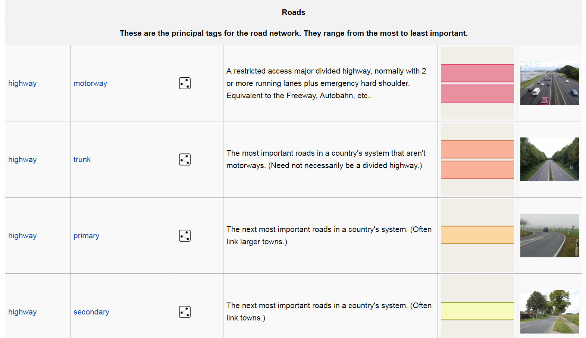


# [Overpass Turbo](https://overpass-turbo.eu/)


# Query Overpass

- Overpass hat eine eigene Abfragesprache

```
node
  [amenity=bar]
  ({{bbox}});
out;
```


# Zwischenfazit - Quellen für inhaltliche Daten

- Gerade auf Staatenebene gibt es sehr viele Daten
- Oftmals hat man aber eigene Daten, die man in einer Karte darstellen möchte
- Frage ist wie sich die inhaltlichen Daten mit den Polygonzügen verbinden lassen


# Verknüpfung von Daten

<!--
http://mjcetce409.blogspot.de/2015/10/
-->


Quelle: [Geographic Information Systems and Remote Sensing](http://mjcetce409.blogspot.de/2015/10/)


# Daten verbinden - Beispiel Eurostat Daten 

- Wir hatten vorhin schon die Haushaltssparrate geladen
- Dabei handelt es sich um einen von den Ausgewählte Wichtigsten Europäische Wirtschaftsindikatoren bei [Eurostat](http://ec.europa.eu/eurostat/web/euro-indicators/peeis) 
- Der Datensatz `wrld_simpl` aus dem Paket `maptools` wird verwendet
- Die Daten werden mit Hilfe des Ländernamens miteinander verknüpft


```{r}
ind <- match(HHsr$geo,wrld_simpl@data$NAME)
ind <- ind[-which(is.na(ind))]
```

- Der `wrld_simpl` Datensatz wird auf Europa eingeschränkt

```{r}
EUR <- wrld_simpl[ind,]
```

- Informationen zur Haushaltssparrate werden hinzugefügt

```{r}
EUR@data$HHSR_2012Q3 <- as.numeric(as.character(HHsr[-(1:2),2]))
EUR@data$HHSR_2015Q2 <- as.numeric(as.character(HHsr[-(1:2),13]))
```


# Karte mit Eurostat Indikator Household Saving Rate

- Mit dem Befehl `spplot` aus dem Paket `sp` ist es möglich zwei Karten nebeneinander darzustellen:

```{r}
spplot(EUR,c("HHSR_2012Q3","HHSR_2015Q2"))
```


# Daten verbinden - Beispiel Bäckereien in Berlin

- Quelle für die folgenden Daten ist: 


<!--
http://wiki.openstreetmap.org/wiki/DE:Datenherkunft_richtig_angeben
-->

# OSM als Datenquelle

- Zum Download habe ich die [Overpass API](http://wiki.openstreetmap.org/wiki/Overpass_API) verwendet

```{r,eval=T,echo=T}
(load("data/info_bar_Berlin.RData"))
```

```{r,echo=F}
info_be <- info[,c("addr.postcode","addr.street","name","lat","lon")]
```

```{r,echo=F}
kable(head(info_be))
```


## Verwendung des Pakets `gosmd`

```{r,eval=F}
devtools::install_github("Japhilko/gosmd")
```


```{r,eval=F}
library("gosmd")
pg_MA <- get_osm_nodes(object="leisure=playground","Mannheim")
pg_MA <- extract_osm_nodes(pg_MA,value='playground')
```


# Matching

```{r}
tab_plz <- table(info_be$addr.postcode)
```


```{r}
ind <- match(BE@data$PLZ99_N,names(tab_plz))
ind
```

## Daten anspielen

```{r}
BE@data$num_plz <- tab_plz[ind]
```

```{r,eval=F,echo=F}
install.packages("colorRamps")
install.packages("XML")
install.packages("geosphere")
install.packages("tmap")
install.packages("curl")
install.packages("R.oo")
```


# Das Paket `tmap`

```{r}
library(tmap)
```

- mit `qtm` kann man schnell eine thematische Karte erzeugen

```{r}
BE@data$num_plz[is.na(BE@data$num_plz)] <- 0
qtm(BE,fill = "num_plz")
```

# Mehr Informationen einbinden

- Der folgende Datensatz ist eine Kombination aus den vorgestellten PLZ-Shapefiles und OSM-Daten die über Overpass heruntergeladen wurden:


```{r}
load("data/osmsa_PLZ_14.RData")
```

```{r,echo=F}
dat_plz <- PLZ@data
kable(head(dat_plz))
```

# OSM-Daten - Bäckereien in Stuttgart

```{r,echo=F}
PLZ_SG <- PLZ[PLZ@data$PLZORT99=="Stuttgart",]
```


```{r}
qtm(PLZ_SG,fill="bakery")
```

# In welchem PLZ Bereich sind die meisten Bäckereien

```{r}
kable(PLZ_SG@data[which.max(PLZ_SG$bakery),c("PLZ99","lat","lon","bakery")])
```


# [Das R-Paket `RDSTK`](http://www.datasciencetoolkit.org/)

```{r,eval=F,echo=F}
install.packages("RDSTK")
```

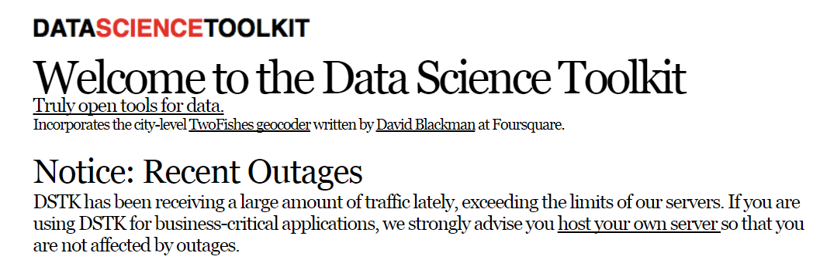

- Data Science Toolkit API

```{r}
library("RDSTK")
```

# Die Daten für Stuttgart

```{r}
PLZ_SG <- PLZ[PLZ@data$PLZORT99=="Stuttgart",]
```

```{r,echo=F}
tab_landcover <- table(PLZ_SG$land_cover.value)
df_landcover <- data.frame(tab_landcover)
colnames(df_landcover)[1] <- c("Type_landcover")
kable(df_landcover)
```


# Eine Karte der Flächenbedeckung erstellen

- Daten von [European Commission Land Resource Management Unit Global Land Cover 2000.](http://bioval.jrc.ec.europa.eu/products/glc2000/products.php)

```{r}
qtm(PLZ_SG,fill="land_cover.value")
```

# Die Höhe in Stuttgart

- Daten von [NASA and the CGIAR Consortium for Spatial Information .](http://srtm.csi.cgiar.org/)

```{r}
qtm(PLZ_SG,fill="elevation.value")
```

<!--
man könnte hier noch zeigen, wie man einen Punkt hinzufügen kann
-->


# Graphiken Stadtleben Stuttgart - das Paket `ggmap`

```{r,eval=F}
devtools::install_github("dkahle/ggmap")
install.packages("ggmap")
```

# Eine erste Karte mit `ggmap` erzeugen

```{r}
library(ggmap)
```


```{r,message=F,eval=F}
qmap("Stuttgart")
```


# Karte für einen ganzen Staat

```{r,message=F,eval=F}
qmap("Germany")
```

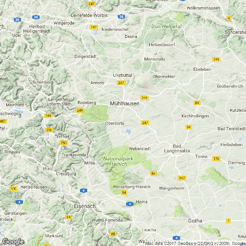

- Wir brauchen ein anderes *zoom level*

# Ein anderes *zoom level*

- level 3 - Kontinent
- level 10 - Stadt
- level 21 - Gebäude

```{r,message=F,eval=F}
qmap("Germany", zoom = 6)
```

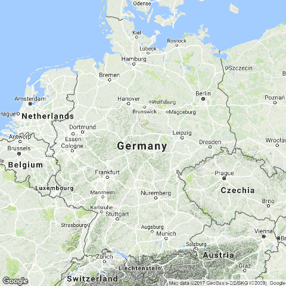

```{r,echo=F}
# https://www.nceas.ucsb.edu/~frazier/RSpatialGuides/ggmap/ggmapCheatsheet.pdf
```


# Karte für eine Sehenswürdigkeit

- `ggmap` - maptype satellite

```{r,message=F,eval=F}
WIL <- qmap("Wilhelma",zoom=20, maptype="satellite")
WIL
```

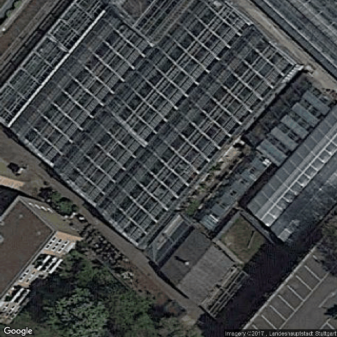

# `ggmap` - maptype satellite zoom 20

```{r,message=F,eval=F}
qmap('Stuttgart Hauptbahnhof', zoom = 15, maptype="hybrid")
```

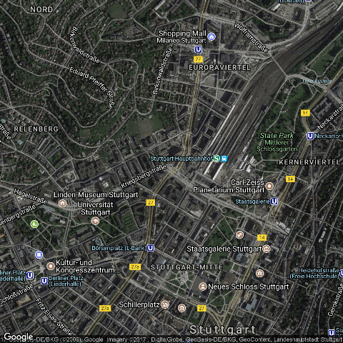

# Eine terrain Karte


```{r,message=F,cache=T,eval=F}
qmap('Stuttgart Fernsehturm', zoom = 14,
 maptype="terrain")
```

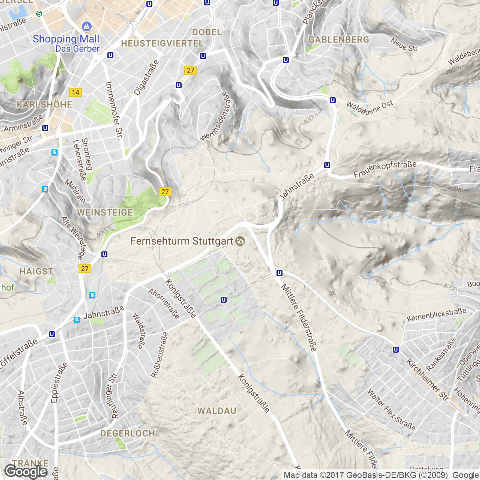

# `ggmap` - maptype watercolor

```{r,message=F,eval=F}
qmap('Stuttgart', zoom = 14,
 maptype="watercolor",source="stamen")
```

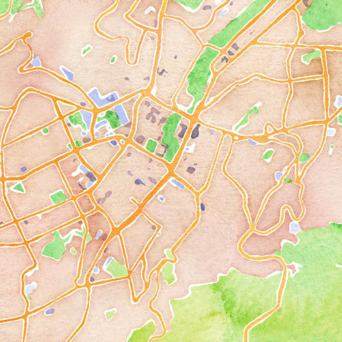

# `ggmap` - source stamen

```{r,message=F,eval=F}
qmap('Stuttgart', zoom = 14,
 maptype="toner",source="stamen")
```

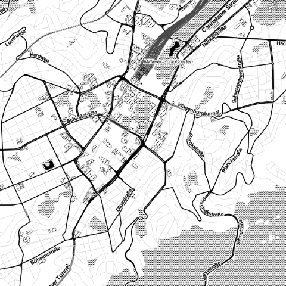

# `ggmap` - maptype toner-lite

```{r,message=F,eval=F}
qmap('Stuttgart', zoom = 14,
 maptype="toner-lite",source="stamen")
```

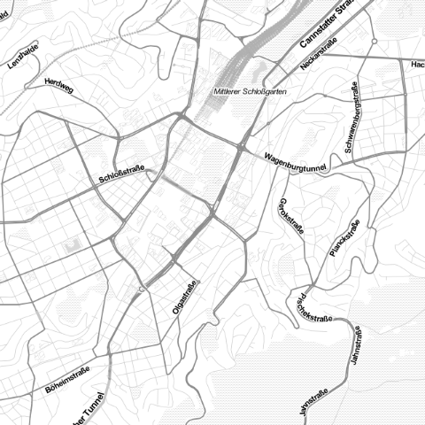
# `ggmap` - maptype toner-hybrid

```{r,message=F,eval=F}
qmap('Stuttgart', zoom = 14,
 maptype="toner-hybrid",source="stamen")
```

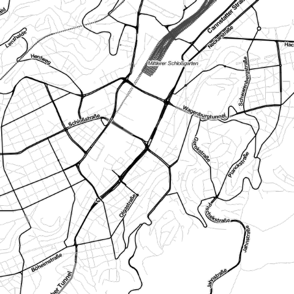

# `ggmap` - maptype terrain-lines

```{r,message=F,eval=F}
qmap('Stuttgart', zoom = 14,
 maptype="terrain-lines",source="stamen")
```

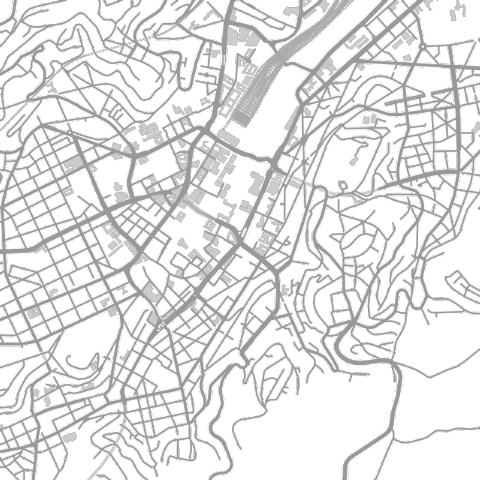


# Geokodierung

> Geocoding (...) uses a description of a location, most typically a postal address or place name, to find geographic coordinates from spatial reference data ... 

[Wikipedia - Geocoding](https://github.com/adam-p/markdown-here/wiki/Markdown-Cheatsheet#blockquotes)

```{r,message=F,eval=T,warning=F}
library(ggmap)
geocode("Stuttgart")
```

```{r,echo=F,message=F,warning=F}
MAgc <- geocode("Stuttgart Wormser Str. 15")
kable(MAgc)
```


# Reverse Geokodierung

> Reverse geocoding is the process of back (reverse) coding of a point location (latitude, longitude) to a readable address or place name. This permits the identification of nearby street addresses, places, and/or areal subdivisions such as neighbourhoods, county, state, or country.

Quelle: [Wikipedia](https://en.wikipedia.org/wiki/Reverse_geocoding)

```{r,cache=T,message=F}
revgeocode(c(48,8))
```


# Die Distanz zwischen zwei Punkten

```{r,message=F}
mapdist("Marienplatz Stuttgart","Hauptbahnhof Stuttgart")
```

```{r,message=F}
mapdist("Marienplatz Stuttgart","Hauptbahnhof Stuttgart",mode="walking")
```


# Eine andere Distanz bekommen

```{r,message=F}
mapdist("Marienplatz Stuttgart","Hauptbahnhof Stuttgart",mode="bicycling")
```

# Geokodierung - verschiedene Punkte von Interesse

```{r,message=F,warning=F}
POI1 <- geocode("B2, 1 Mannheim",source="google")
POI2 <- geocode("Hbf Mannheim",source="google")
POI3 <- geocode("Mannheim, Friedrichsplatz",source="google")
ListPOI <-rbind(POI1,POI2,POI3)
POI1;POI2;POI3
```


# Punkte in der Karte

```{r,message=F,warning=F,eval=F}
MA_map +
geom_point(aes(x = lon, y = lat),
data = ListPOI)
```

# Punkte in der Karte

```{r,message=F,warning=F,eval=F}
MA_map +
geom_point(aes(x = lon, y = lat),col="red",
data = ListPOI)
```


# `ggmap` - verschiedene Farben

```{r,eval=F}
ListPOI$color <- c("A","B","C")
MA_map +
geom_point(aes(x = lon, y = lat,col=color),
data = ListPOI)
```

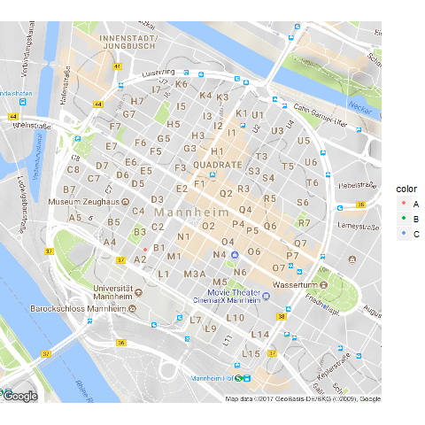

# `ggmap` - größere Punkte

```{r,eval=F}
ListPOI$size <- c(10,20,30)
MA_map +
geom_point(aes(x = lon, y = lat,col=color,size=size),
data = ListPOI)
```

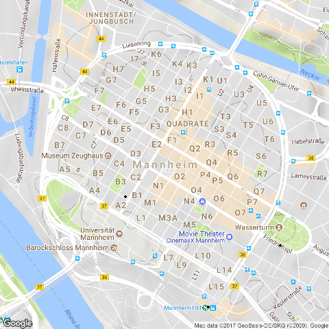

# Eine Route von Google maps bekommen

```{r,message=F,warning=F,cache=T,eval=F}
from <- "Mannheim Hbf"
to <- "Mannheim B2 , 1"
route_df <- route(from, to, structure = "route")
```

[Mehr Information](http://rpackages.ianhowson.com/cran/ggmap/man/route.html)

<http://rpackages.ianhowson.com/cran/ggmap/man/route.html>

# Eine Karte mit dieser Information zeichnen

```{r,message=F,warning=F,cache=T,eval=F}
qmap("Mannheim Hbf", zoom = 14) +
  geom_path(
    aes(x = lon, y = lat),  colour = "red", size = 1.5,
    data = route_df, lineend = "round"
  )
```

<!--

-->
Wie fügt man Punkte hinzu

- Nutzung von [geom_point](http://zevross.com/blog/2014/07/16/mapping-in-r-using-the-ggplot2-package/)


- Question on [stackoverflow](http://stackoverflow.com/questions/15069963/getting-a-map-with-points-using-ggmap-and-ggplot2)

<http://i.stack.imgur.com>

 
# Cheatsheet

- Cheatsheet zu [data visualisation](https://www.rstudio.com/wp-content/uploads/2015/04/ggplot2-cheatsheet.pdf)

<https://www.rstudio.com/>

<!--

-->


# Das Paket `ggmap`

```{r ggmap_citycenter}
library(ggmap)
lon_plz <- PLZ_SG@data[which.max(PLZ_SG$bakery),"lon"]
lat_plz <- PLZ_SG@data[which.max(PLZ_SG$bakery),"lat"]
mp_plz <- as.numeric(c(lon_plz,lat_plz))
qmap(location = mp_plz,zoom=15)
```


# Das Paket `osmar`

```{r}
library(osmar) 
```


```{r,eval=F}
src <- osmsource_api()
gc <- geocode("Stuttgart-Degerloch")
bb <- center_bbox(gc$lon, gc$lat, 800, 800)
ua <- get_osm(bb, source = src)
plot(ua)
```

```{r,echo=F}
load("data/ua_SG_cc.RData")
plot(ua)
```

# Gebäude in diesem Ausschnitt plotten

```{r}
bg_ids <- find(ua, way(tags(k=="building")))
bg_ids <- find_down(ua, way(bg_ids))
bg <- subset(ua, ids = bg_ids)
bg_poly <- as_sp(bg, "polygons")  
plot(bg_poly)
```

# Gebäude und Straßen im Ausschnitt

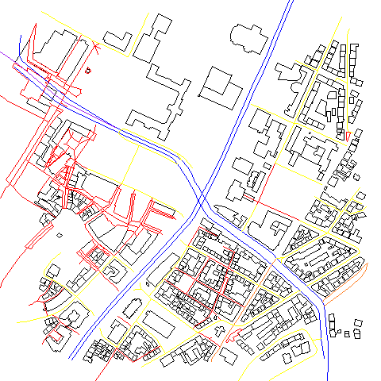

<!--
Interaktive Karten
http://rmaps.github.io/
-->

# Schlussfolie

Vielen Dank für die Aufmerksamkeit


# Erweiterungsmöglichkeiten

- Interaktive Karten mit dem Paket `leaflet`

http://rpubs.com/Japhilko82/Rleaflet

<!--
xxxxtodo: Point in Polygon Methode
-->

# [Karte auf Carto zur Energieerzeugung](https://japhilko.carto.com/viz/f31db8c4-8f7d-11e5-b394-0ef7f98ade21/public_map)

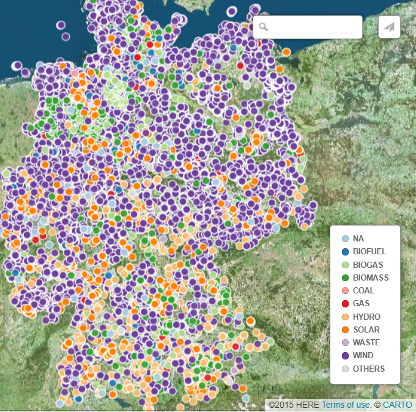