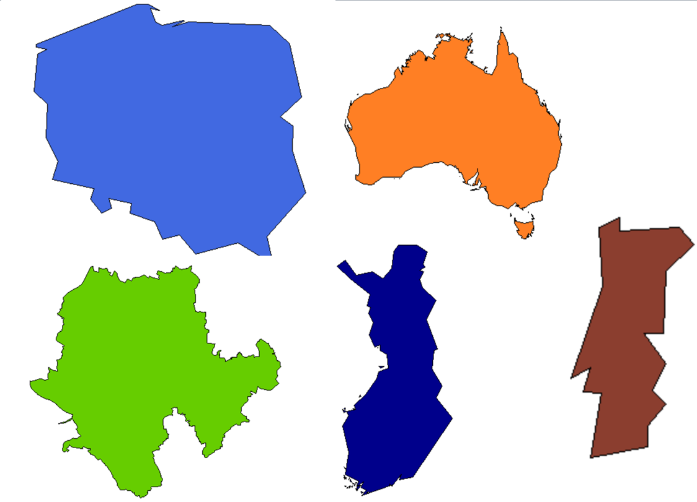

```{r, include=FALSE}
knitr::opts_chunk$set(echo = TRUE,cache=T,warning=F,message=FALSE)
par(mai=c(0,0,0,0))
log_gesis=T
log_home=F
internet=T
noint = F
```


# Motivation - [Deutschlands größte Klimasünder](http://www.spiegel.de/wissenschaft/mensch/deutschland-das-sind-die-groessten-klimasuender-a-1178207.html)

- Spiegel Artikel am 16.11.2017 aus Anlass der Jamaika Gespräche


# Gliederung

- Quellen für Polygonzüge (Staaten, Gemeinden, PLZ Bereiche etc.)
- Quellen für inhaltliche Daten
- Pakete zur Erstellung thematischer Karten (bspw. Pakete `maptools`, `sp`, `tmap`)
- Verknüpfung von Daten
- Beispiele für die Darstellung in Karten
 
<!--
Beim letzten Punkt colour Picker einbauen - Folien maps
-->

```{r,echo=F,eval=F}
install.packages("knitr")
install.packages("sp")
install.packages("tmap")
```


```{r,echo=F}
library(knitr)
```

```{r,echo=F,eval=F}
setwd("~/GitHub/GeoData/presentations/ps_user_stuttgart")
purl("ps_user_stuttgart_part3.Rmd")
```


```{r,eval=F,echo=F}
setwd("D:/Daten/GitHub/GeoData/presentations/ps_user_stuttgart")
purl("ps_user_stuttgart_part3.Rmd")
```


# Quellen für Polygonzüge



# Hello World

```{r}
library(maps)
map()
```


# Das Paket `maps` - etwas detailierter


Grenzen sind recht grob:

```{r}
map("world", "Germany")
```


<!--
Die Befehle im Paket maps sind etwas anders als bei den anderen Paketen.
-->

# Das Paket `maps` - Mehr Information

- Nur für manche Staaten bekommt man Umkreise für Einheiten unterhalb der Staatsgrenze (bspw. Frankreich, USA). 

```{r}
data(world.cities)
map("france")
map.cities(world.cities,col="blue")
```


# Das Paket `maptools`

- Das Paket `maptools` hat intuitivere Bedienung, zudem können Shapefiles verarbeitet werden.

```{r}
library(maptools)
data(wrld_simpl)
plot(wrld_simpl,col="royalblue")
```

# Was sind shapefiles (`.shp`)?

- Das Dateiformat Shapefile ist ein ursprünglich für die Software ArcView der Firma ESRI entwickeltes Format für Geodaten. (Quelle: [Wikipedia](https://de.wikipedia.org/wiki/Shapefile))

```{r,eval=F}
head(wrld_simpl@data)
```

```{r,echo=F,eval=noint}
kable(head(wrld_simpl@data))
```

```{r,echo=F,eval=internet}
library(DT)
datatable(wrld_simpl@data)
```


```{r}
length(wrld_simpl)
nrow(wrld_simpl@data)
```

# Einzelne Elemente des Datensatzes plotten

```{r}
ind <- which(wrld_simpl$ISO3=="DEU")
```

```{r}
plot(wrld_simpl[ind,])
```

```{r}
wrld_simpl@data[ind,]
```


# Andere Quellen für Shapefiles - Das Paket `raster`

- Für Polygonzüge unterhalb der Staatsgrenzen ist [Global Administrative Boundaries](http://www.gadm.org/) eine gute Quelle.
- Vor allem weil es auch eine API gibt, die man mit dem Paket `raster` nutzen kann.

```{r,warning=F}
library(raster)
LUX1 <- getData('GADM', country='LUX', level=1)
plot(LUX1)
```

# Daten für das Luxemburg Beispiel

```{r,eval=F}
head(LUX1@data)
```


```{r,eval=noint,echo=F}
kable(head(LUX1@data))
```

```{r,eval=noint,echo=F}
datatable(LUX1@data)
```


# [Shapefiles bei Eurostat](http://ec.europa.eu/eurostat/de/web/gisco/geodata/reference-data/administrative-units-statistical-units)


# BKG - Quelle für Kreise in Deutschland

- Umrisse von 402 Kreisen in Deutschland
- Quelle: [Bundesamt für Kartographie und Geodäsie](http://www.geodatenzentrum.de/geodaten/gdz_rahmen.gdz_div?gdz_spr=deu&gdz_akt_zeile=5&gdz_anz_zeile=1&gdz_unt_zeile=15&gdz_user_id=0) (BKG)
- Karten gibt es auch für Bundesländer und Gemeinden


```{r,eval=F}
library(maptools)
krs <- readShapePoly("vg250_ebenen/vg250_krs.shp")
plot(krs)
```

```{r,echo=F,eval=log_gesis}
library(maptools)
krs <- readShapePoly("D:/Daten/Daten/GeoDaten/vg250_ebenen/vg250_krs.shp")
```

```{r,echo=F}
library(DT)
```

```{r,echo=F,eval=F}
datatable(krs@data)
```

```{r}
head(krs@data$RS)
```

- Die Kreise für Baden-Württemberg
- Systematik hinter dem Amtlichen Gemeindeschlüssel (AGS) bzw. Regionalschlüssel (RS) bei [Wikipedia](https://de.wikipedia.org/wiki/Amtlicher_Gemeindeschl%C3%BCssel)

```{r}
BLA <- substr(krs@data$RS,1,2)
plot(krs[BLA=="08",])
```

# [Shapefiles für Wahlkreise](https://www.bundeswahlleiter.de/bundestagswahlen/2017/wahlkreiseinteilung/downloads.html)


# Ortsnetzbereiche

Quelle: [Bundesnetzagentur](https://www.bundesnetzagentur.de/DE/Sachgebiete/Telekommunikation/Unternehmen_Institutionen/Nummerierung/Rufnummern/ONRufnr/ON_Einteilung_ONB/ON_ONB_ONKz_ONBGrenzen_Basepage.html)

<!-- 
ggf. noch mal neu herunterladen
--> 

```{r,echo=F,eval=log_gesis}
setwd("D:/Daten/Daten/GeoDaten/")
```

```{r,eval=F,echo=F}
install.packages("maptools")
```


```{r,eval=log_gesis,echo=F}
library(maptools)
setwd("D:/Daten/Daten/GeoDaten/")

onb <- readShapePoly("onb_grenzen.shp")
kable(head(onb@data))
```


```{r,eval=F}
onb <- readShapePoly("onb_grenzen.shp")
```

```{r,eval=F}
head(onb@data)
```

```{r,eval=!internet,echo=F}
kable(head(onb@data))
```

```{r,eval=internet,echo=F}
datatable(onb@data)
```


# Vorwahlbereiche in der Region Stuttgart

```{r,eval=log_gesis,tidy=T}
vw_stg<-c("0711","07121","07122") 
vw_reg_stg<-onb[onb@data$VORWAHL%in%vw_stg,]
plot(vw_reg_stg)
```


# Einen größeren Vorwahlbereich ausschneiden

```{r,eval=log_gesis}
vwb <- as.character(onb@data$ONB_NUMMER)
vwb1 <- substr(vwb, 1,2)
vwb7 <- onb[vwb1=="07",]
plot(vwb7)
```


# Das Paket `rgdal`

- Postleitzahlenbereiche - <http://arnulf.us/PLZ>

```{r}
library(rgdal)
```


```{r,eval=log_gesis,echo=F}
setwd("D:/Daten/Daten/GeoDaten")
PLZ <- readOGR ("post_pl.shp","post_pl")
```

```{r,eval=log_home}
setwd("D:/GESIS/Workshops/GeoDaten/data/")
PLZ <- readOGR ("post_pl.shp","post_pl")
```


```{r,eval=F}
library(rgdal)
PLZ <- readOGR ("post_pl.shp","post_pl")
```

# PLZ-Bereiche in Stuttgart

```{r}
SG <- PLZ[PLZ@data$PLZORT99=="Stuttgart",]
plot(SG,col="chocolate1")
```

# PLZ-Bereiche in Berlin

```{r}
BE <- PLZ[PLZ@data$PLZORT99%in%c("Berlin-West","Berlin (östl. Stadtbezirke)"),]
plot(BE,col="chocolate2")
```

# Zwischenfazit - Quellen für Polygonzüge

- In einigen R-Paketen sind Polygonzüge hinterlegt
- Umgang mit den Daten unterscheidet sich
- Am sinnvollsten ist das arbeiten mit Shapefiles (.shp)
- Neben den R-Paketen gibt es zahlreiche weitere Quellen für Polygonzüge.

# Thematische Karten mit R erstellen


# Thematische Karten erzeugen - das Paket `sp`

```{r}
library(sp)
spplot(wrld_simpl,"POP2005")
```

# Andere Einfärbungen wählen - Das Paket `colorRamps`

```{r,eval=F,echo=F}
install.packages("colorRamps")
```

```{r}
library(colorRamps)
spplot(wrld_simpl,"POP2005",col.regions=blue2red(100))
```

# Es gibt auch noch mehr Farbverläufe im Paket `colorRamps`

- `blue2green`, `blue2yellow`

```{r}
spplot(wrld_simpl,"POP2005",col.regions=matlab.like(100))
```


# Eurostat Daten

Sie können eine Statistik der Sparquote bei [Eurostat](http://ec.europa.eu/eurostat/web/euro-indicators/peeis) downloaden.

<http://ec.europa.eu/eurostat/web/euro-indicators/peeis>

```{r,echo=F,eval=log_gesis}
setwd("J:/Work/Statistik/Kolb/Workshops/2015/Spatial_MA/Folien/dataImport/data/")
```

```{r,eval=F}
library(xlsx)
HHsr <- read.xlsx2("HHsavingRate.xls",1)
```

```{r,echo=F,eval=F}
kable(HHsr[1:8,1:6])
```


# [Zensus Ergebnisse](https://www.zensus2011.de/SharedDocs/Aktuelles/Ergebnisse/DemografischeGrunddaten.html)


# Zensus Atlas

<https://ergebnisse.zensus2011.de/>


# [datahub.io](datahub.io)


# Weltkulturerbestätten

```{r,eval=F}
url <- "https://raw.githubusercontent.com/Japhilko/
GeoData/master/2015/data/whcSites.csv"

whcSites <- read.csv(url) 
```

```{r,echo=F}
url <- "https://raw.githubusercontent.com/Japhilko/GeoData/master/2015/data/whcSites.csv"

whcSites <- read.csv(url) 
```

```{r,echo=F}
kable(head(whcSites[,c("name_en","date_inscribed","longitude","latitude","area_hectares","category","states_name_fr")]))
```


# Exkurs -  [OpenStreetMap](http://www.openstreetmap.de/) Projekt

> OpenStreetMap.org ist ein im Jahre 2004 gegründetes internationales Projekt mit dem Ziel, eine freie Weltkarte zu erschaffen. Dafür sammeln wir weltweit Daten über Straßen, Eisenbahnen, Flüsse, Wälder, Häuser und vieles mehr. 

<http://www.openstreetmap.de/>

# Export von OpenStreetMap Daten

<www.openstreetmap.org/export>


# [OpenStreetMap - Map Features](http://wiki.openstreetmap.org/wiki/Map_Features)


## [Overpass Turbo](https://overpass-turbo.eu/)


## Query Overpass

```
node
  [amenity=bar]
  ({{bbox}});
out;
```


# Zwischenfazit - Quellen für inhaltliche Daten

- Gerade auf Staatenebene gibt es sehr viele Daten
- Oftmals hat man aber eigene Daten, die man in einer Karte darstellen möchte
- Frage ist wie sich die inhaltlichen Daten mit den Polygonzügen verbinden lassen


## Verknüpfung von Daten

<!--
http://mjcetce409.blogspot.de/2015/10/
-->


Quelle: [Geographic Information Systems and Remote Sensing](http://mjcetce409.blogspot.de/2015/10/)


# Daten verbinden - Beispiel Bäckereien in Berlin

- Quelle für die folgenden Daten ist: 


<!--
http://wiki.openstreetmap.org/wiki/DE:Datenherkunft_richtig_angeben
-->

# OSM als Datenquelle

- Zum Download habe ich die [Overpass API](http://wiki.openstreetmap.org/wiki/Overpass_API) verwendet

```{r,eval=T,echo=T}
(load("data/info_bar_Berlin.RData"))
```

```{r,echo=F}
info_be <- info[,c("addr.postcode","addr.street","name","lat","lon")]
```

```{r,echo=F}
kable(head(info_be))
```

# Matching

```{r}
tab_plz <- table(info_be$addr.postcode)
```


```{r}
ind <- match(BE@data$PLZ99_N,names(tab_plz))
ind
```

# Daten anspielen

```{r}
BE@data$num_plz <- tab_plz[ind]
```

```{r,eval=F,echo=F}
install.packages("colorRamps")
install.packages("XML")
install.packages("geosphere")
install.packages("tmap")
install.packages("curl")
install.packages("R.oo")
```


# Das Paket `tmap`

```{r}
library(tmap)
```

- mit qmap kann man schnell eine thematische Karte erzeugen

```{r}
BE@data$num_plz[is.na(BE@data$num_plz)] <- 0
qtm(BE,fill = "num_plz")
```

# Mehr Informationen einbinden

- Der folgende Datensatz ist eine Kombination aus den vorgestellten PLZ-Shapefiles und OSM-Daten die über Overpass heruntergeladen wurden:


```{r}
load("data/osmsa_PLZ_14.RData")
```

```{r,echo=F}
dat_plz <- PLZ@data
kable(head(dat_plz))
```

# OSM-Daten - Bäckereien in Stuttgart

```{r,echo=F}
PLZ_SG <- PLZ[PLZ@data$PLZORT99=="Stuttgart",]
```


```{r}
qtm(PLZ_SG,fill="bakery")
```

# In welchem PLZ Bereich sind die meisten Bäckereien

```{r}
kable(PLZ_SG@data[which.max(PLZ_SG$bakery),c("PLZ99","lat","lon","bakery")])
```

# Das Paket `ggmap`

```{r ggmap_citycenter}
library(ggmap)
lon_plz <- PLZ_SG@data[which.max(PLZ_SG$bakery),"lon"]
lat_plz <- PLZ_SG@data[which.max(PLZ_SG$bakery),"lat"]
mp_plz <- as.numeric(c(lon_plz,lat_plz))
qmap(location = mp_plz,zoom=15)
```


# [Das R-Paket `RDSTK`](http://www.datasciencetoolkit.org/)

```{r,eval=F,echo=F}
install.packages("RDSTK")
```


- Data Science Toolkit API

```{r}
library("RDSTK")
```

# Die Daten für Stuttgart

```{r}
PLZ_SG <- PLZ[PLZ@data$PLZORT99=="Stuttgart",]
```

```{r,echo=F}
tab_landcover <- table(PLZ_SG$land_cover.value)
df_landcover <- data.frame(tab_landcover)
colnames(df_landcover)[1] <- c("Type_landcover")
kable(df_landcover)
```


# Eine Karte der Flächenbedeckung erstellen

- Daten von [European Commission Land Resource Management Unit Global Land Cover 2000.](http://bioval.jrc.ec.europa.eu/products/glc2000/products.php)

```{r,eval=F}
qtm(PLZ_SG,fill="land_cover.value")
```

# Die Höhe in Stuttgart

- Daten von [NASA and the CGIAR Consortium for Spatial Information .](http://srtm.csi.cgiar.org/)

```{r,eval=F}
qtm(PLZ_SG,fill="elevation.value")
```

<!--
man könnte hier noch zeigen, wie man einen Punkt hinzufügen kann
-->

# Das Paket `osmar`

```{r}
library(osmar) 
```


```{r,eval=F}
src <- osmsource_api()
gc <- geocode("Stuttgart-Degerloch")
bb <- center_bbox(gc$lon, gc$lat, 800, 800)
ua <- get_osm(bb, source = src)
plot(ua)
```

# Graphiken Stadtleben Stuttgart

<!--
Interaktive Karten
http://rmaps.github.io/
-->

# Interaktive Karten mit dem Paket `leaflet`

```{r}
library(leaflet)

m = leaflet() %>% addTiles()
m 
```


