The first library
-----------------

-   R is a modular programmin language
-   For many tasks it is necessary to load packages

<!-- -->

      # install the library
    # install.packages("maps")

      # load the library
    library(maps)

    ## Warning: package 'maps' was built under R version 3.1.3

Hello world
-----------

    map("world")

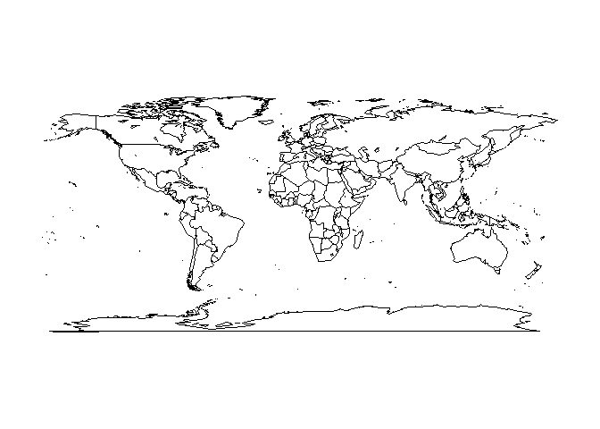

A map of the USA
----------------

-   with the argument col, it is possible to specify the border color

<!-- -->

    map('usa',col="blue")

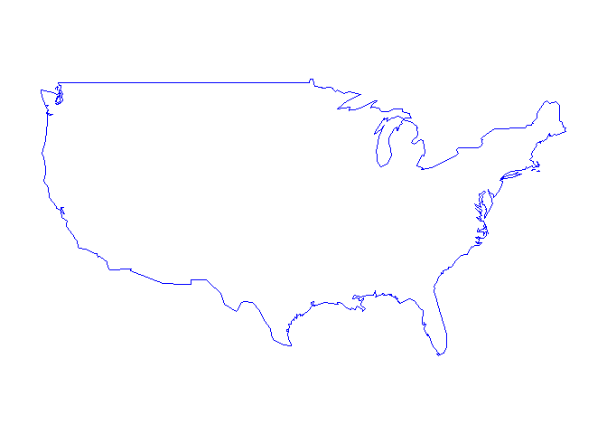

A map of France
---------------

    map("france",fill=T,col="green")

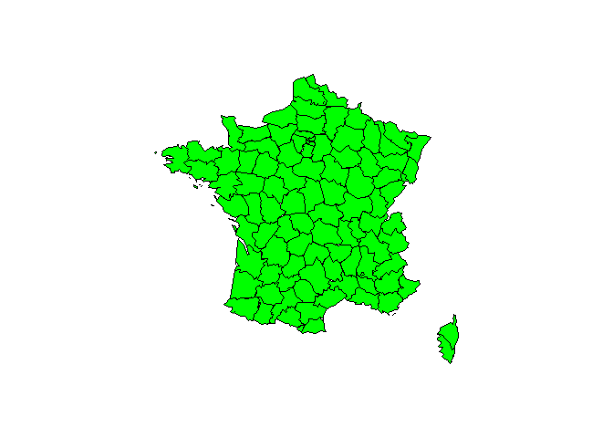

A map of Italy
--------------

-   get more than one color

<!-- -->

    map("italy",fill=T, col = 1:10)

A map of US-states
------------------

    map("state")

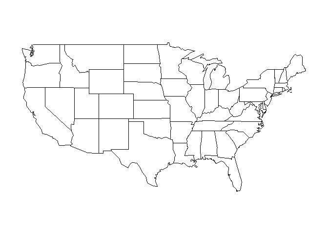

Maps of other countries
-----------------------

-   For most of the countries you have to specify two arguments:

<!-- -->

    map("world", "Germany")

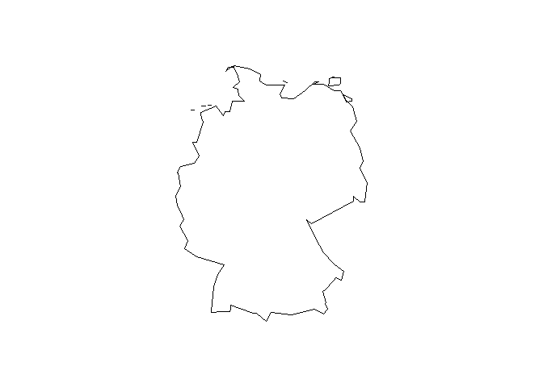

More than one country in a map
------------------------------

    map("world", c("Germany","Poland"))

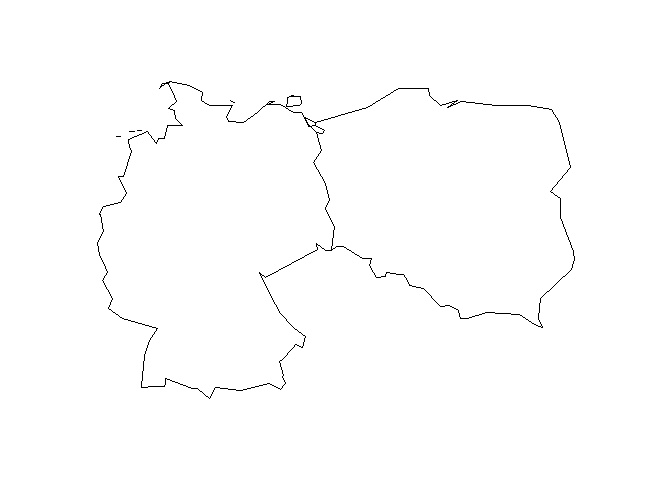

More than one country in a map with colors
------------------------------------------

    map("world", c("Germany","Austria"),fill=T,col=c("red","green"))

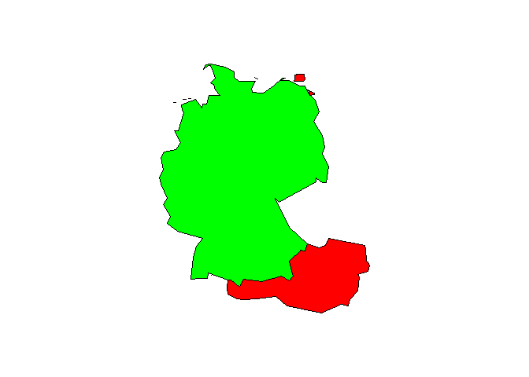

Map scales
----------

    map("world", "China")
    map.scale()

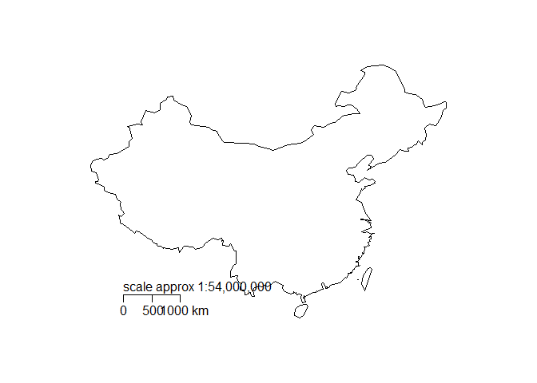

Maps with labels
----------------

    map.text("world", "Germany")

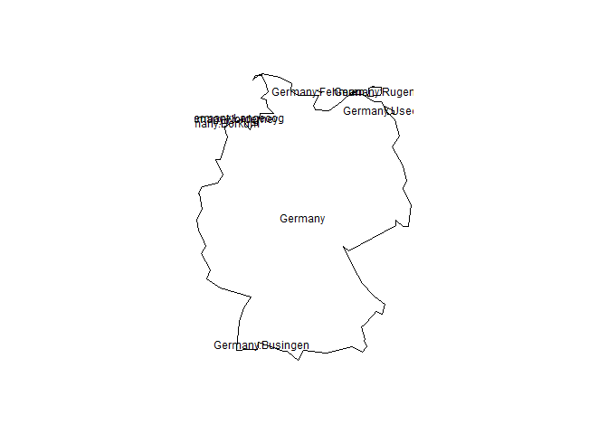

Cities data set
---------------

    data(us.cities)

<table>
<thead>
<tr class="header">
<th align="left">name</th>
<th align="left">country.etc</th>
<th align="right">pop</th>
<th align="right">lat</th>
<th align="right">long</th>
<th align="right">capital</th>
</tr>
</thead>
<tbody>
<tr class="odd">
<td align="left">Abilene TX</td>
<td align="left">TX</td>
<td align="right">113888</td>
<td align="right">32.45</td>
<td align="right">-99.74</td>
<td align="right">0</td>
</tr>
<tr class="even">
<td align="left">Akron OH</td>
<td align="left">OH</td>
<td align="right">206634</td>
<td align="right">41.08</td>
<td align="right">-81.52</td>
<td align="right">0</td>
</tr>
<tr class="odd">
<td align="left">Alameda CA</td>
<td align="left">CA</td>
<td align="right">70069</td>
<td align="right">37.77</td>
<td align="right">-122.26</td>
<td align="right">0</td>
</tr>
<tr class="even">
<td align="left">Albany GA</td>
<td align="left">GA</td>
<td align="right">75510</td>
<td align="right">31.58</td>
<td align="right">-84.18</td>
<td align="right">0</td>
</tr>
<tr class="odd">
<td align="left">Albany NY</td>
<td align="left">NY</td>
<td align="right">93576</td>
<td align="right">42.67</td>
<td align="right">-73.80</td>
<td align="right">2</td>
</tr>
<tr class="even">
<td align="left">Albany OR</td>
<td align="left">OR</td>
<td align="right">45535</td>
<td align="right">44.62</td>
<td align="right">-123.09</td>
<td align="right">0</td>
</tr>
</tbody>
</table>

Map German cities
-----------------

    map("world", "Germany")
    map.cities(country = "Germany")

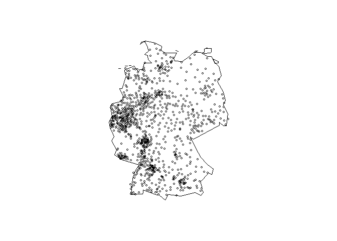

Map only capital
----------------

    map("world", "Germany")
    map.cities(country = "Germany",capitals=1)

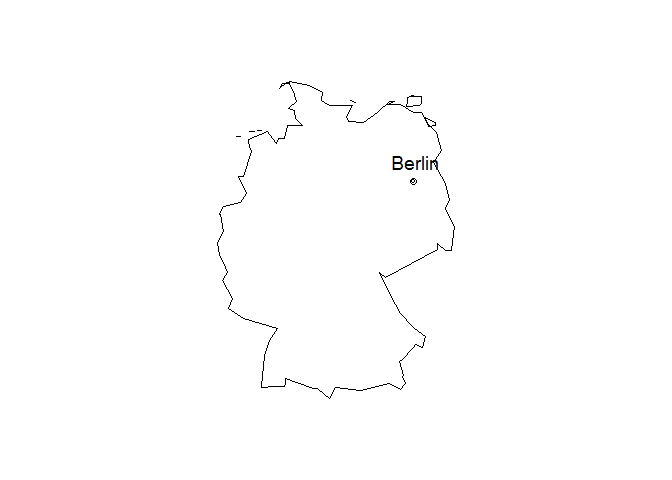

Data set world cities
---------------------

    data(world.cities)

<table>
<thead>
<tr class="header">
<th align="left">name</th>
<th align="left">country.etc</th>
<th align="right">pop</th>
<th align="right">lat</th>
<th align="right">long</th>
<th align="right">capital</th>
</tr>
</thead>
<tbody>
<tr class="odd">
<td align="left">'Abasan al-Jadidah</td>
<td align="left">Palestine</td>
<td align="right">5629</td>
<td align="right">31.31</td>
<td align="right">34.34</td>
<td align="right">0</td>
</tr>
<tr class="even">
<td align="left">'Abasan al-Kabirah</td>
<td align="left">Palestine</td>
<td align="right">18999</td>
<td align="right">31.32</td>
<td align="right">34.35</td>
<td align="right">0</td>
</tr>
<tr class="odd">
<td align="left">'Abdul Hakim</td>
<td align="left">Pakistan</td>
<td align="right">47788</td>
<td align="right">30.55</td>
<td align="right">72.11</td>
<td align="right">0</td>
</tr>
<tr class="even">
<td align="left">'Abdullah-as-Salam</td>
<td align="left">Kuwait</td>
<td align="right">21817</td>
<td align="right">29.36</td>
<td align="right">47.98</td>
<td align="right">0</td>
</tr>
<tr class="odd">
<td align="left">'Abud</td>
<td align="left">Palestine</td>
<td align="right">2456</td>
<td align="right">32.03</td>
<td align="right">35.07</td>
<td align="right">0</td>
</tr>
<tr class="even">
<td align="left">'Abwein</td>
<td align="left">Palestine</td>
<td align="right">3434</td>
<td align="right">32.03</td>
<td align="right">35.20</td>
<td align="right">0</td>
</tr>
</tbody>
</table>

Change type of symbol
---------------------

    map("world", "Germany")
    map.cities(country = "Germany",pch=20,col="red")

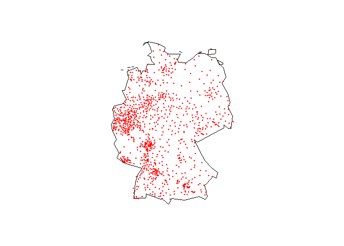
