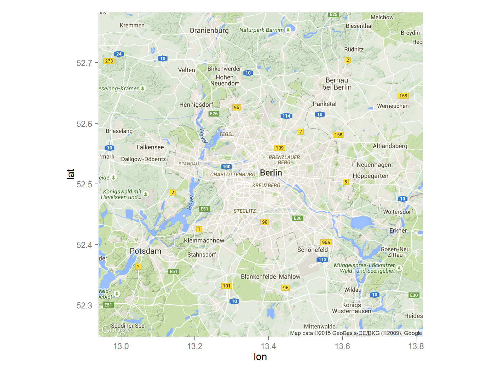
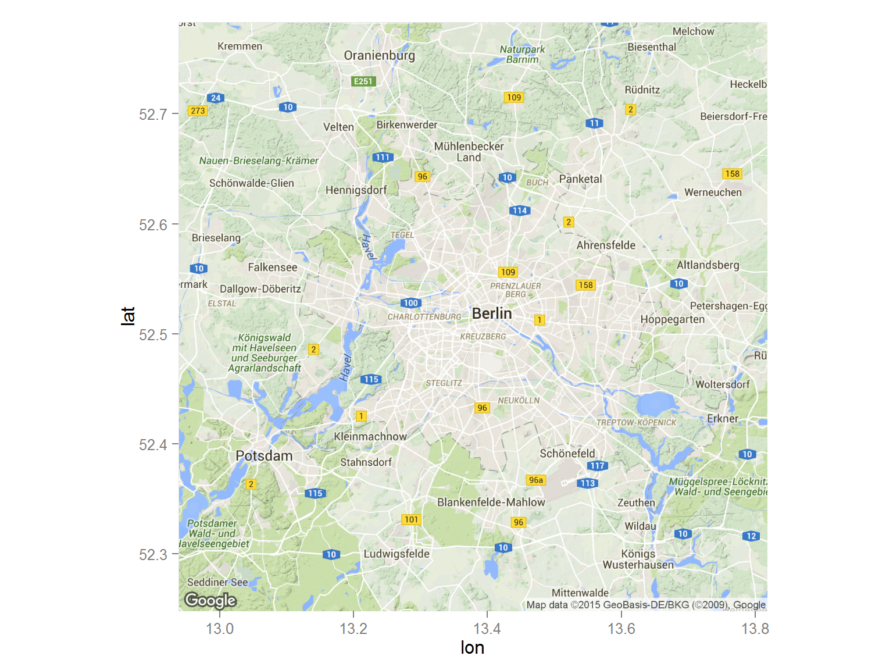
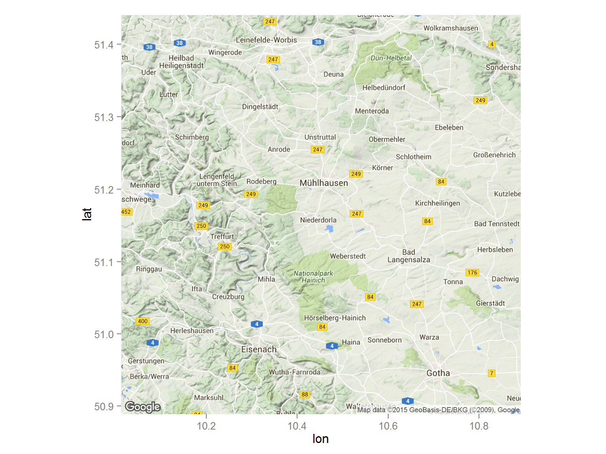
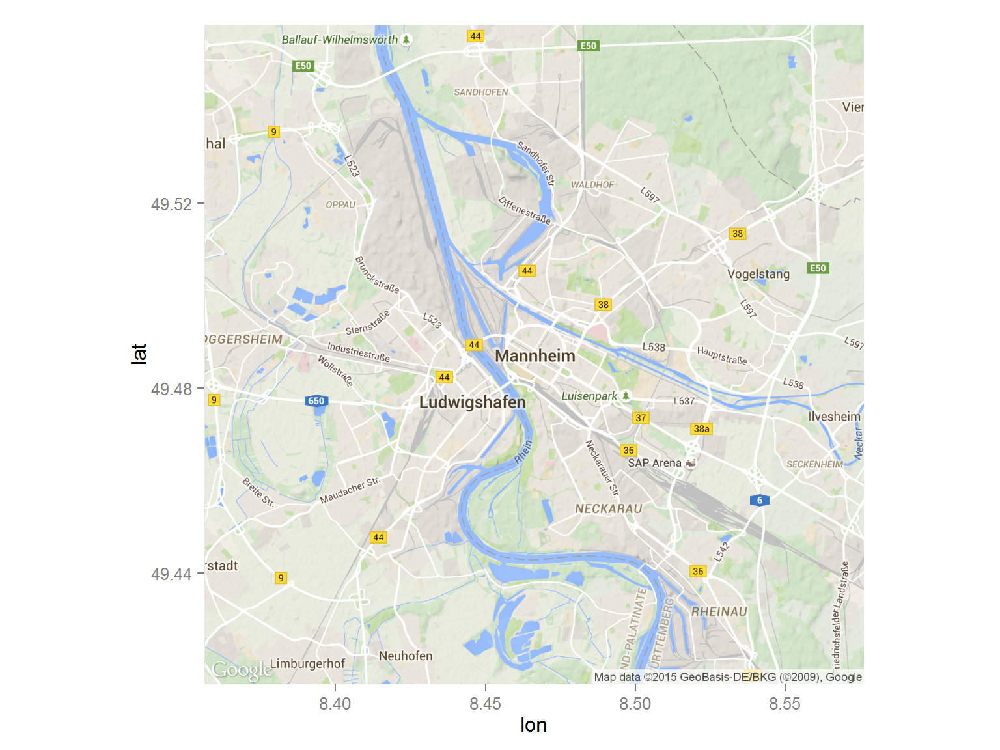
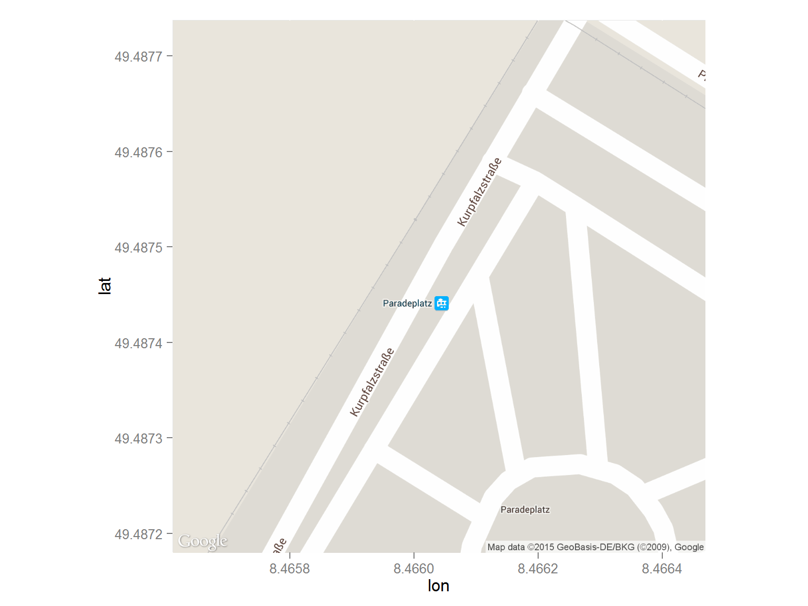
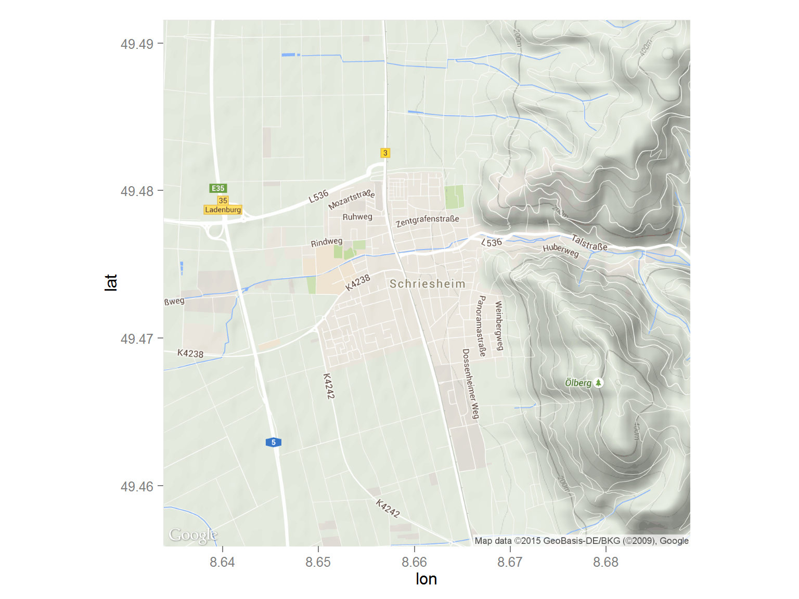
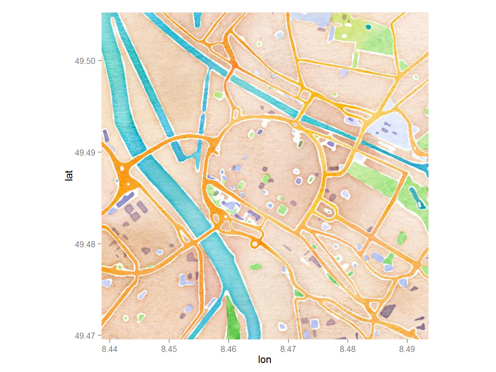
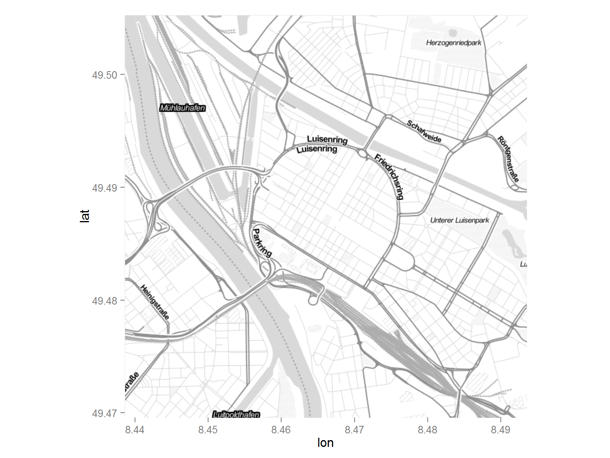
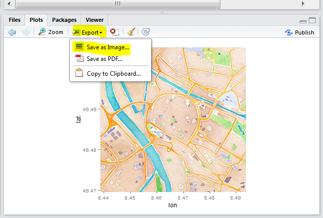

## Outline

The R-package [ggmap](http://journal.r-project.org/archive/2013-1/kahle-wickham.pdf) will be used in the following to 

produce different types of maps with the command [qmap](http://www.inside-r.org/packages/cran/ggmap/docs/qmap)

- [Road map](https://www.nceas.ucsb.edu/~frazier/RSpatialGuides/ggmap/ggmapCheatsheet.pdf) 
- Satellite map 
- Terrain map/physical map


## Road maps

A road map is one of the most widely used map types. 

- These maps show major and minor highways and roads (depending on
detail) 

- as well as things like airports, city locations and points of
interest like parks, campgrounds and monuments. 

- Major highways on a road map are generally red and larger than other roads, 

- while minor roads are a lighter color and a narrower line.

## Road maps

<!--html_preserve--><div id="htmlwidget-3065" style="width:768px;height:576px;" class="leaflet"></div>
<script type="application/json" data-for="htmlwidget-3065">{"x":{"setView":[[49.49671,8.47955],12,[]],"calls":[{"method":"addTiles","args":["http://{s}.tile.openstreetmap.org/{z}/{x}/{y}.png",null,null,{"minZoom":0,"maxZoom":18,"maxNativeZoom":null,"tileSize":256,"subdomains":"abc","errorTileUrl":"","tms":false,"continuousWorld":false,"noWrap":false,"zoomOffset":0,"zoomReverse":false,"opacity":1,"zIndex":null,"unloadInvisibleTiles":null,"updateWhenIdle":null,"detectRetina":false,"reuseTiles":false,"attribution":"&copy; <a href=\"http://openstreetmap.org\">OpenStreetMap</a> contributors, <a href=\"http://creativecommons.org/licenses/by-sa/2.0/\">CC-BY-SA</a>"}]}]},"evals":[]}</script><!--/html_preserve-->


## Install the library

- We'll need package ggmap 


```r
install.packages("ggmap")
```


## Library ggmap

- To load the library we use the command `library`


```r
library(ggmap)
```


```r
qmap("Mannheim")
```


## Map for a sight


```r
qmap("Berlin Brandenburger Tor")
```




## Map for a whole country

- We need another zoom level


```r
qmap("Germany")
```



## Use another zoom level

- level 3 - continent
- level 10 - city
- level 21 - building


```r
qmap("Germany", zoom = 6)
```




## Get help with the questionmark


```r
?qmap
```

Different components in the help

- Description
- Usage
- Arguments
- Value
- Author(s)
- See Also
- Examples


## The examples section of help


Extract from the help file on qmap:


```

This examples can be directly copy-pasted to the console


```r
qmap(location = "baylor university")
qmap(location = "baylor university", zoom = 14)
# and so on
```


## Other zoom level


```r
qmap("Mannheim", zoom = 12)
```



## Get closer


```r
qmap(location = 'Mannheim', zoom = 13)
```


## Get very close


```r
qmap('Mannheim', zoom = 20)
```


## ggmap - source OpenStreetMap


```r
qmap('Mannheim', zoom = 14, source="osm")
```



## ggmap - OpenStreetMap - black/white


```r
qmap('Mannheim', zoom = 14, source="osm",color="bw")
```


## ggmap - maptype satellite


```r
qmap('Mannheim', zoom = 14, maptype="satellite")
```


## ggmap - maptype satellite zoom 21


```r
qmap('Mannheim', zoom = 21, maptype="hybrid")
```


## ggmap - maptype hybrid


```r
qmap('Mannheim', zoom = 14, maptype="hybrid")
```


## Terrain/physical maps

Physical maps illustrate the physical features of an area, such as the mountains, rivers and lakes.
Colors are used to show relief differences in land elevations.

- The water is usually shown in blue.
- a lighter color is typically used at lower elevation and
- darker color indicate higher elevations.
- Contour lines can also be used to show elevation changes (they are normally spaced at regular intervals)

## ggmap - terrain map


```r
qmap('Schriesheim', zoom = 14,
 maptype="terrain")
```


## Stamen maps

These high-contrast B+W (black and white) maps are featured in our Dotspotting project. They are perfect for data mashups and exploring river meanders and coastal zones. 

Source: <http://maps.stamen.com/>

## ggmap - source stamen


```r
qmap('Mannheim', zoom = 14,
 maptype="toner",source="stamen")
```




## ggmap - maptype watercolor


```r
qmap('Mannheim', zoom = 14,
 maptype="watercolor",source="stamen")
```



## ggmap - maptype toner-lite


```r
qmap('Mannheim', zoom = 14,
 maptype="toner-lite",source="stamen")
```


## ggmap - maptype toner-hybrid


```r
qmap('Mannheim', zoom = 14,
 maptype="toner-hybrid",source="stamen")
```


## ggmap - maptype terrain-lines


```r
qmap('Mannheim', zoom = 14,
 maptype="terrain-lines",source="stamen")
```



## Save graphics





## ggmap - create an object 

- `<-` is an assignment operator which can be used to create an object
- This is useful if you work with several maps at the same time


```r
MA_map <- qmap('Mannheim', 
               zoom = 14,
               maptype="toner",
               source="stamen")
```


## Geocoding

> Geocoding (...) uses a description of a location, most typically a postal address or place name, to find geographic coordinates from spatial reference data ... 

[Wikipedia - Geocoding](https://github.com/adam-p/markdown-here/wiki/Markdown-Cheatsheet#blockquotes)


```r
library(ggmap)
geocode("Mannheim Wasserturm",source="google")
```


      lon        lat
---------  ---------
 8.462233   49.48371


## Latitude and Longitude


[Source](http://modernsurvivalblog.com/survival-skills/basic-map-reading-latitude-longitude/)

## Coords of different places in Germany


```
## Information from URL : http://maps.googleapis.com/maps/api/geocode/json?address=Hamburg&sensor=false
## Information from URL : http://maps.googleapis.com/maps/api/geocode/json?address=Koeln&sensor=false
## Information from URL : http://maps.googleapis.com/maps/api/geocode/json?address=Dresden&sensor=false
## Information from URL : http://maps.googleapis.com/maps/api/geocode/json?address=Muenchen&sensor=false
```


cities            lon        lat
---------  ----------  ---------
Hamburg      9.993682   53.55108
Koeln        6.960279   50.93753
Dresden     13.737262   51.05041
Muenchen    11.581981   48.13513


## Reverse geocoding

> Reverse geocoding is the process of back (reverse) coding of a point location (latitude, longitude) to a readable address or place name. This permits the identification of nearby street addresses, places, and/or areal subdivisions such as neighbourhoods, county, state, or country.

Source: [Wikipedia](https://en.wikipedia.org/wiki/Reverse_geocoding)


```r
revgeocode(c(48,8))
```

```
## [1] "Qoriley Rd, Somalia"
```


## Get the distance between 2 points


```r
mapdist("Q1, 4 Mannheim","B2, 1 Mannheim")
```

```
##             from             to   m    km     miles seconds  minutes
## 1 Q1, 4 Mannheim B2, 1 Mannheim 746 0.746 0.4635644     211 3.516667
##        hours
## 1 0.05861111
```


```r
mapdist("Q1, 4 Mannheim","B2, 1 Mannheim",mode="walking")
```

```
##             from             to   m    km     miles seconds minutes
## 1 Q1, 4 Mannheim B2, 1 Mannheim 546 0.546 0.3392844     420       7
##       hours
## 1 0.1166667
```


## Get another distance


```r
mapdist("Q1, 4 Mannheim","B2, 1 Mannheim",mode="bicycling")
```

```
##             from             to   m    km    miles seconds  minutes
## 1 Q1, 4 Mannheim B2, 1 Mannheim 555 0.555 0.344877     215 3.583333
##        hours
## 1 0.05972222
```

## Geocoding - points of interest


```r
POI1 <- geocode("B2, 1 Mannheim",source="google")
POI2 <- geocode("Hbf Mannheim",source="google")
POI3 <- geocode("Wasserturm Mannheim",source="google")
ListPOI <-rbind(POI1,POI2,POI3)
POI1;POI2;POI3
```

```
##        lon      lat
## 1 8.462844 49.48569
```

```
##        lon      lat
## 1 8.469879 49.47972
```

```
##        lon      lat
## 1 8.473664 49.48483
```


## Points in map


```r
MA_map +
geom_point(aes(x = lon, y = lat),
data = ListPOI)
```


## Points in map


```r
MA_map +
geom_point(aes(x = lon, y = lat),col="red",
data = ListPOI)
```


## ggmap - adding different colors


```r
ListPOI$color <- c("A","B","C")
MA_map +
geom_point(aes(x = lon, y = lat,col=color),
data = ListPOI)
```


## ggmap - bigger dots


```r
ListPOI$size <- c(10,20,30)
MA_map +
geom_point(aes(x = lon, y = lat,col=color,size=size),
data = ListPOI)
```


## Get a route from Google maps


```r
from <- "Mannheim Hbf"
to <- "Mannheim B2 , 1"
route_df <- route(from, to, structure = "route")
```

[More information](http://rpackages.ianhowson.com/cran/ggmap/man/route.html)

## Draw a map with this information


```r
qmap("Mannheim Hbf", zoom = 14) +
  geom_path(
    aes(x = lon, y = lat),  colour = "red", size = 1.5,
    data = route_df, lineend = "round"
  )
```


## Resources

- [Article by David Kahle and Hadley Wickham](http://journal.r-project.org/archive/2013-1/kahle-wickham.pdf) on the usage of ggmap.
- [Grab a map](http://rpackages.ianhowson.com/cran/ggmap/man/get_map.html)
- [Making Maps in R](http://www.kevjohnson.org/making-maps-in-r-part-2/)

More about adding points

- Usage of [geom_point](http://zevross.com/blog/2014/07/16/mapping-in-r-using-the-ggplot2-package/)
- Question on [stackoverflow](http://stackoverflow.com/questions/15069963/getting-a-map-with-points-using-ggmap-and-ggplot2)


## Cheatsheet

- Cheatsheet on [data visualisation](https://www.rstudio.com/wp-content/uploads/2015/04/ggplot2-cheatsheet.pdf)


## Resources and literature

[ggmap: Spatial Visualization with ggplot2](http://citeseerx.ist.psu.edu/viewdoc/download?doi=10.1.1.375.8693&rep=rep1&type=pdf)

by David Kahle and Hadley Wickham
 
