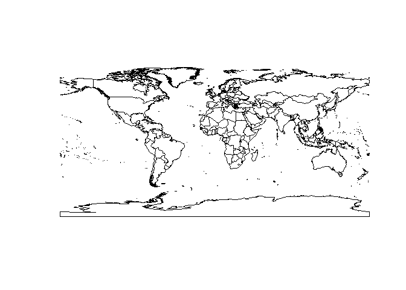
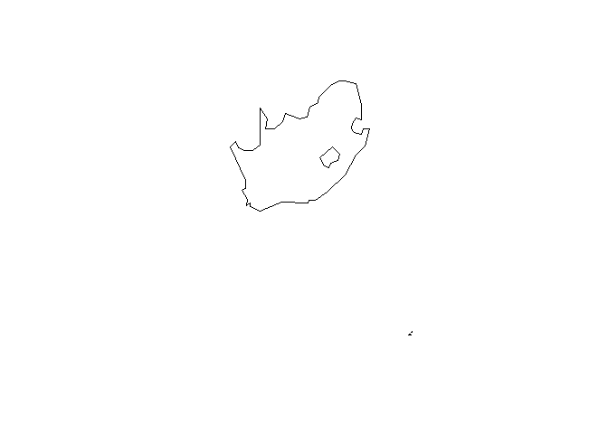
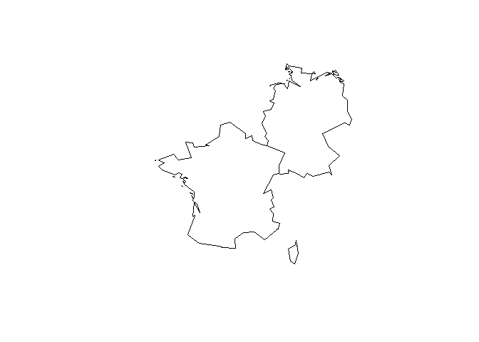
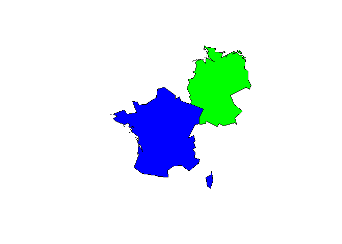
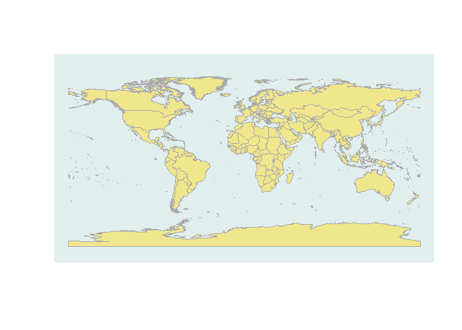
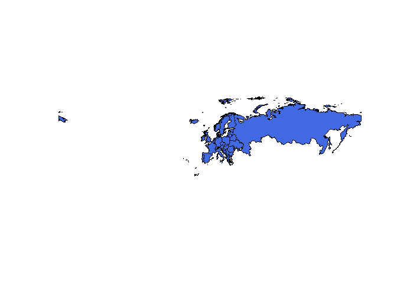

The library maptools
--------------------

-   The data set wrld\_simpl has polygons for the most countries in the
    world

<!-- -->

    library(maptools)

    ## Loading required package: sp
    ## Checking rgeos availability: FALSE
    ##      Note: when rgeos is not available, polygon geometry     computations in maptools depend on gpclib,
    ##      which has a restricted licence. It is disabled by default;
    ##      to enable gpclib, type gpclibPermit()

    data(wrld_simpl)

Hello world
-----------

    plot(wrld_simpl)

The data set behind
-------------------

    head(wrld_simpl@data)

<table>
<thead>
<tr class="header">
<th align="left"></th>
<th align="left">FIPS</th>
<th align="left">ISO2</th>
<th align="left">ISO3</th>
<th align="right">UN</th>
<th align="left">NAME</th>
<th align="right">AREA</th>
<th align="right">POP2005</th>
<th align="right">REGION</th>
<th align="right">SUBREGION</th>
<th align="right">LON</th>
<th align="right">LAT</th>
</tr>
</thead>
<tbody>
<tr class="odd">
<td align="left">ATG</td>
<td align="left">AC</td>
<td align="left">AG</td>
<td align="left">ATG</td>
<td align="right">28</td>
<td align="left">Antigua and Barbuda</td>
<td align="right">44</td>
<td align="right">83039</td>
<td align="right">19</td>
<td align="right">29</td>
<td align="right">-61.783</td>
<td align="right">17.078</td>
</tr>
<tr class="even">
<td align="left">DZA</td>
<td align="left">AG</td>
<td align="left">DZ</td>
<td align="left">DZA</td>
<td align="right">12</td>
<td align="left">Algeria</td>
<td align="right">238174</td>
<td align="right">32854159</td>
<td align="right">2</td>
<td align="right">15</td>
<td align="right">2.632</td>
<td align="right">28.163</td>
</tr>
<tr class="odd">
<td align="left">AZE</td>
<td align="left">AJ</td>
<td align="left">AZ</td>
<td align="left">AZE</td>
<td align="right">31</td>
<td align="left">Azerbaijan</td>
<td align="right">8260</td>
<td align="right">8352021</td>
<td align="right">142</td>
<td align="right">145</td>
<td align="right">47.395</td>
<td align="right">40.430</td>
</tr>
<tr class="even">
<td align="left">ALB</td>
<td align="left">AL</td>
<td align="left">AL</td>
<td align="left">ALB</td>
<td align="right">8</td>
<td align="left">Albania</td>
<td align="right">2740</td>
<td align="right">3153731</td>
<td align="right">150</td>
<td align="right">39</td>
<td align="right">20.068</td>
<td align="right">41.143</td>
</tr>
<tr class="odd">
<td align="left">ARM</td>
<td align="left">AM</td>
<td align="left">AM</td>
<td align="left">ARM</td>
<td align="right">51</td>
<td align="left">Armenia</td>
<td align="right">2820</td>
<td align="right">3017661</td>
<td align="right">142</td>
<td align="right">145</td>
<td align="right">44.563</td>
<td align="right">40.534</td>
</tr>
<tr class="even">
<td align="left">AGO</td>
<td align="left">AO</td>
<td align="left">AO</td>
<td align="left">AGO</td>
<td align="right">24</td>
<td align="left">Angola</td>
<td align="right">124670</td>
<td align="right">16095214</td>
<td align="right">2</td>
<td align="right">17</td>
<td align="right">17.544</td>
<td align="right">-12.296</td>
</tr>
</tbody>
</table>

The structure of the data set
-----------------------------

-   with head you get only the first entries

<!-- -->

    head(wrld_simpl@data$NAME)

    ## [1] Antigua and Barbuda Algeria             Azerbaijan         
    ## [4] Albania             Armenia             Angola             
    ## 246 Levels: Aaland Islands Afghanistan Albania Algeria ... Zimbabwe

A logical request
-----------------

    ind_SA <- wrld_simpl@data$NAME =="South Africa"
    head(ind_SA)

    ## [1] FALSE FALSE FALSE FALSE FALSE FALSE

    table(ind_SA)

    ## ind_SA
    ## FALSE  TRUE 
    ##   245     1

A map for South Africa
----------------------

-   plot only one country

<!-- -->

    SouthAfrica <- wrld_simpl[ind_SA,]
    plot(SouthAfrica)

Select more than one country
----------------------------

    EuropeList <- c('Germany', 'France')
    my_map <- wrld_simpl[wrld_simpl$NAME %in% EuropeList, ]
    plot(my_map)

More color
----------

    my_map@data$color <- c("blue","green")
    plot(my_map,col=my_map@data$color)

More color for the world
------------------------

    plot(wrld_simpl, bg='azure2', col='khaki', border='#AAAAAA')

A map for Europe
----------------

    Europe <- wrld_simpl[wrld_simpl$REGION=="150",]
    plot(Europe,col="royalblue")

