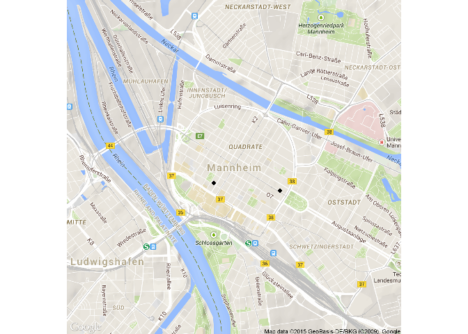

Library ggmap
-------------

    library(ggmap)

    qmap("Mannheim")

    MA_map <- qmap("Mannheim",zoom=14)

Other zoom level
----------------

    qmap(location = 'Mannheim', zoom = 12)

Get closer
----------

    qmap(location = 'Mannheim', zoom = 13)

Get very close
--------------

    qmap(location = 'Mannheim', zoom = 20)

ggmap - source
--------------

    qmap(location = 'Mannheim', zoom = 14, source="osm")

ggmap - maptype
---------------

    qmap(location = 'Mannheim', zoom = 14, maptype="satellite")

ggmap - maptype
---------------

    qmap(location = 'Mannheim', zoom = 14, maptype="hybrid")

ggmap - maptype
---------------

    qmap(location = 'Mannheim', zoom = 14,
     maptype="toner",source="stamen")

Geocoding
---------

    POI <- c("B2, 1 Mannheim","Hbf Mannheim",
             "Wasserturm Mannheim")

    ListPOI <- data.frame(lat=NA,lon=NA)

    for ( i in 1:length(POI)){
      geoPOI <- geocode(POI[i])
      ListPOI[i,"lat"] <-  geoPOI$lat 
      ListPOI[i,"lon"] <-  geoPOI$lon 
    }

Points in map
-------------

<http://journal.r-project.org/archive/2013-1/kahle-wickham.pdf>

    MA_map +
    geom_point(aes(x = lon, y = lat),
    data = ListPOI)

