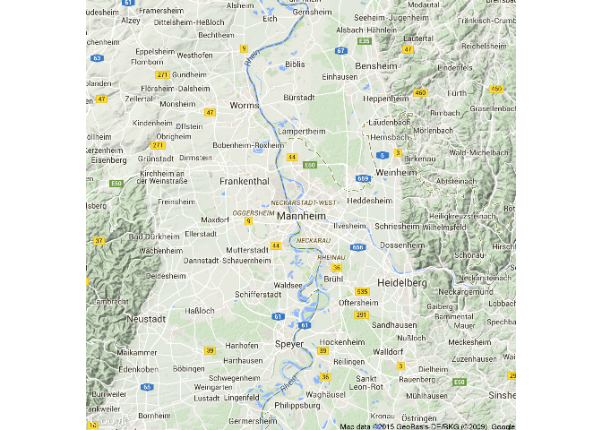
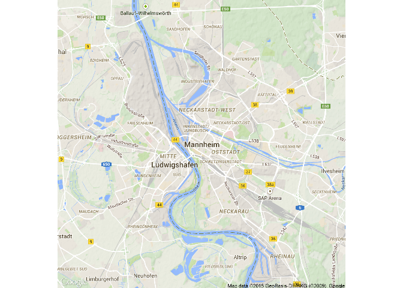
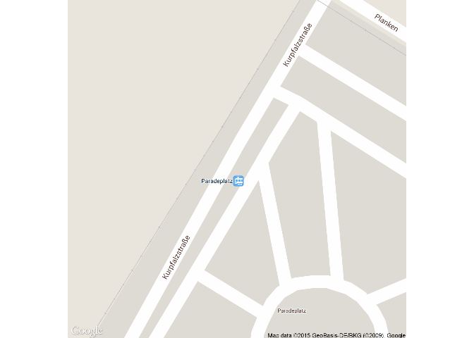
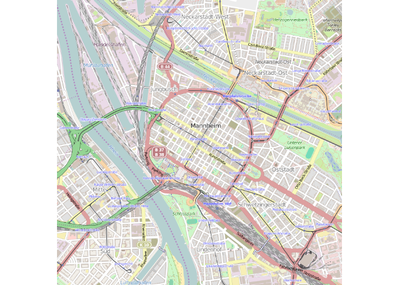
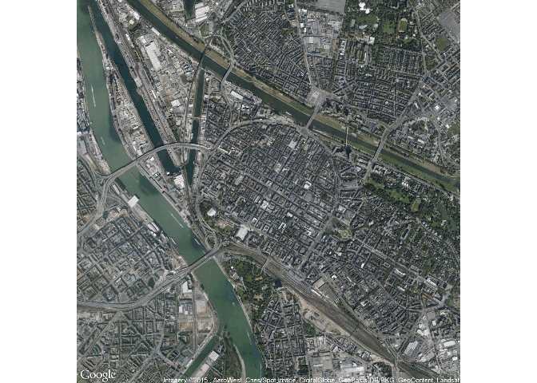
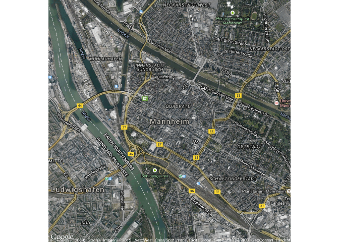
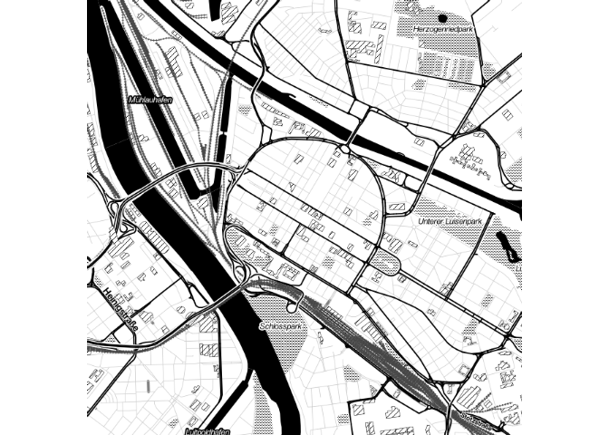
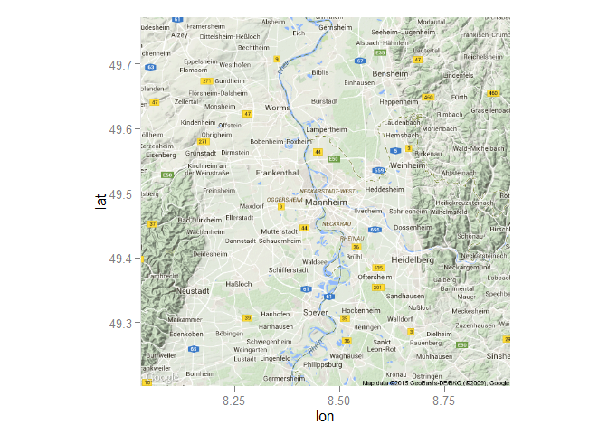

Library ggmap
-------------

    library(ggmap)

    qmap("Mannheim")

    MA_map <- qmap("Mannheim",zoom=14)

Other zoom level
----------------

    qmap(location = 'Mannheim', zoom = 12)

Get closer
----------

    qmap(location = 'Mannheim', zoom = 13)

Get very close
--------------

    qmap(location = 'Mannheim', zoom = 20)

ggmap - source
--------------

    qmap(location = 'Mannheim', zoom = 14, source="osm")

ggmap - maptype
---------------

    qmap(location = 'Mannheim', zoom = 14, maptype="satellite")

ggmap - maptype
---------------

    qmap(location = 'Mannheim', zoom = 14, maptype="hybrid")

ggmap - maptype
---------------

    qmap(location = 'Mannheim', zoom = 14,
     maptype="toner",source="stamen")

Other ways to get a map
-----------------------

-   qmap is a wrapper for ggmap and get\_map
-   with get\_googlemap you get similar results

<!-- -->

    MAmap <- get_googlemap("Mannheim")

    ## Map from URL : http://maps.googleapis.com/maps/api/staticmap?center=Mannheim&zoom=10&size=%20640x640&maptype=terrain&sensor=false
    ## Google Maps API Terms of Service : http://developers.google.com/maps/terms
    ## Information from URL : http://maps.googleapis.com/maps/api/geocode/json?address=Mannheim&sensor=false
    ## Google Maps API Terms of Service : http://developers.google.com/maps/terms

    ggmap(MAmap)

Geocoding
---------

    POI <- c("B2, 1 Mannheim","Hbf Mannheim",
             "Wasserturm Mannheim")

    ListPOI <- data.frame(lat=NA,lon=NA)

    for ( i in 1:length(POI)){
      geoPOI <- geocode(POI[i])
      ListPOI[i,"lat"] <-  geoPOI$lat 
      ListPOI[i,"lon"] <-  geoPOI$lon 
    }

Points in map
-------------

<http://journal.r-project.org/archive/2013-1/kahle-wickham.pdf>

    MA_map +
    geom_point(aes(x = lon, y = lat),
    data = ListPOI)

Get the distance between 2 points
---------------------------------

    mapdist("Q1, 4 Mannheim","B2, 1 Mannheim")

    ##             from             to   m    km     miles seconds minutes  hours
    ## 1 Q1, 4 Mannheim B2, 1 Mannheim 741 0.741 0.4604574     207    3.45 0.0575

    mapdist("Q1, 4 Mannheim","B2, 1 Mannheim",mode="walking")

    ##             from             to   m    km     miles seconds  minutes
    ## 1 Q1, 4 Mannheim B2, 1 Mannheim 546 0.546 0.3392844     421 7.016667
    ##       hours
    ## 1 0.1169444

    mapdist("Q1, 4 Mannheim","B2, 1 Mannheim",mode="bicycling")

    ##             from             to   m    km    miles seconds  minutes
    ## 1 Q1, 4 Mannheim B2, 1 Mannheim 555 0.555 0.344877     215 3.583333
    ##        hours
    ## 1 0.05972222
