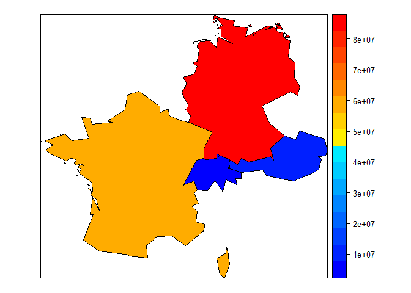
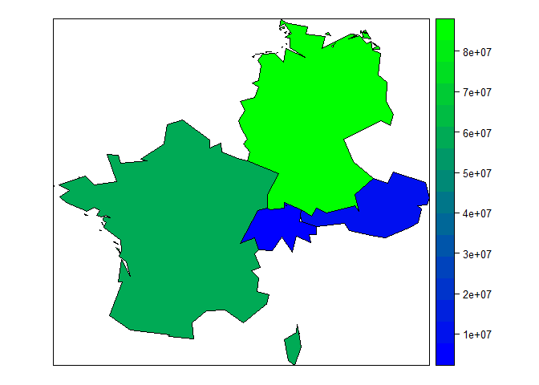
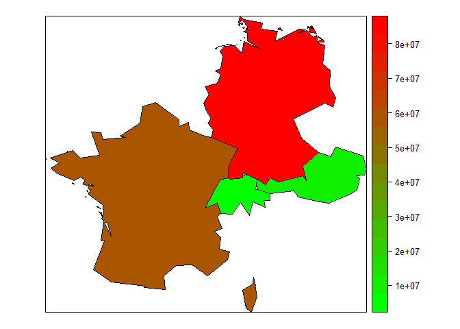
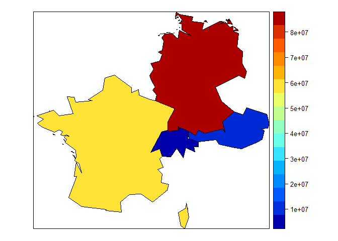

The package [sp](https://cran.r-project.org/web/packages/sp/index.html)
-----------------------------------------------------------------------

-   Classes and methods for spatial data
-   Authors: Edzer Pebesma, Roger Bivand, Barry Rowlingson, Virgilio
    Gomez-Rubio et. al.
-   Many
    [Introductions](http://ifgi.uni-muenster.de/~epebe_01/Aufbaukurs/R/slides_R.pdf)
    available

<!-- -->

    library(sp)

Hello world
-----------

-   A first example using data from maptools
    ([ISO2-codes](http://en.wikipedia.org/wiki/ISO_3166-1_alpha-2))

<!-- -->

    library(maptools)
    data("wrld_simpl")
    ISO2codes <- wrld_simpl@data$ISO2
    countries <- c("FR","DE","AT","CH")
    ind <- match(countries,ISO2codes)
    my_map <- wrld_simpl[ind,]

Plot my map
-----------

    plot(my_map)

The data set
------------

    head(my_map@data)

<table>
<thead>
<tr class="header">
<th align="left"></th>
<th align="left">ISO2</th>
<th align="left">NAME</th>
<th align="right">AREA</th>
<th align="right">POP2005</th>
<th align="right">REGION</th>
</tr>
</thead>
<tbody>
<tr class="odd">
<td align="left">FRA</td>
<td align="left">FR</td>
<td align="left">France</td>
<td align="right">55010</td>
<td align="right">60990544</td>
<td align="right">150</td>
</tr>
<tr class="even">
<td align="left">DEU</td>
<td align="left">DE</td>
<td align="left">Germany</td>
<td align="right">34895</td>
<td align="right">82652369</td>
<td align="right">150</td>
</tr>
<tr class="odd">
<td align="left">AUT</td>
<td align="left">AT</td>
<td align="left">Austria</td>
<td align="right">8245</td>
<td align="right">8291979</td>
<td align="right">150</td>
</tr>
<tr class="even">
<td align="left">CHE</td>
<td align="left">CH</td>
<td align="left">Switzerland</td>
<td align="right">4000</td>
<td align="right">7424389</td>
<td align="right">150</td>
</tr>
</tbody>
</table>

First example
-------------

    spplot(my_map,"POP2005")

Using `colorRamps`
------------------

    library(colorRamps)
    spplot(my_map,"POP2005",col.regions=blue2red(100))

Using `colorRamps`
------------------

    spplot(my_map,"POP2005",col.regions=blue2green(100))

Using `colorRamps`
------------------

    spplot(my_map,"POP2005",col.regions=green2red(100))

Using `colorRamps`
------------------

    spplot(my_map,"POP2005",col.regions=blue2yellow(100))

Using `colorRamps`
------------------

    spplot(my_map,"POP2005",col.regions=matlab.like(100))

Using synthetic data
--------------------

Generating synthetic data (Population 2010)

    my_map$Pop2010 <- my_map$POP2005 + 
                        runif(length(my_map),-10000,10000)

Colors [matlab](http://de.mathworks.com/products/matlab/) like
--------------------------------------------------------------

    spplot(my_map,c("POP2005","Pop2010"),
           col.regions=matlab.like(100))

More examples
-------------

-   [Stamen maps with
    spplot](https://procomun.wordpress.com/2013/04/24/stamen-maps-with-spplot/)

-   [Know India through
    visualisation](http://justanotherdatablog.blogspot.de/2014/02/know-india-through-visualisations-1.html)

-   [Great
    circles](https://procomun.wordpress.com/2011/05/20/great-circles/)

-   [Canadian vote
    compass](http://blog.revolutionanalytics.com/2011/12/vote-compass-visualizing-canadian-poll-results-with-r.html)

-   [More colors in
    R](http://www.r-bloggers.com/using-the-new-viridis-colormap-in-r-thanks-to-simon-garnier/)

Vignettes for package `sp`
--------------------------

-   Edzer Pebesma - [Customising spatial data classes and
    methods](https://cran.r-project.org/web/packages/sp/vignettes/csdacm.pdf)

-   Edzer Pebesma and Roger S. Bivand - [S Classes and Methods for
    Spatial Data: the `sp`
    Package](https://cran.r-project.org/web/packages/sp/vignettes/intro_sp.pdf)

-   Edzer Pebesma - [Map overlay and spatial aggregation in
    sp](https://cran.r-project.org/web/packages/sp/vignettes/over.pdf)

Projections
-----------

-   [Spatial Reference Identifier](https://en.wikipedia.org/wiki/SRID)

-   [Working with
    shapefiles](http://lincolnmullen.com/projects/dh-r/geospatial-data.html)

-   [srid for
    OpenStreetMap](http://gis.stackexchange.com/questions/48949/epsg-3857-or-4326-for-googlemaps-openstreetmap-and-leaflet)
