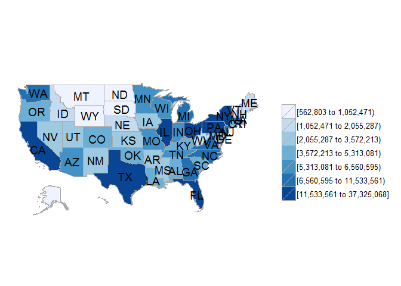
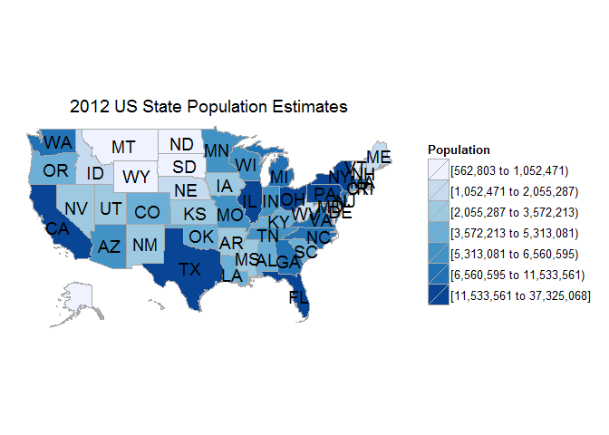
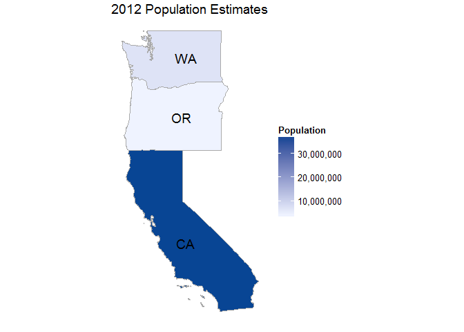
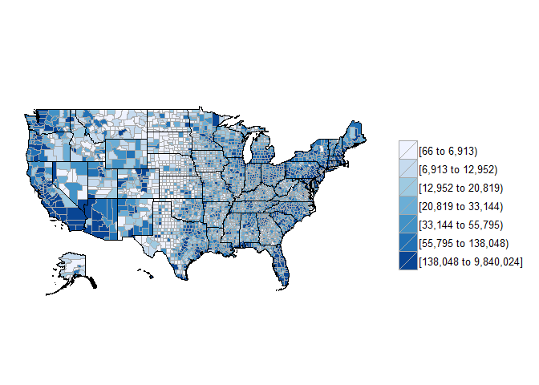
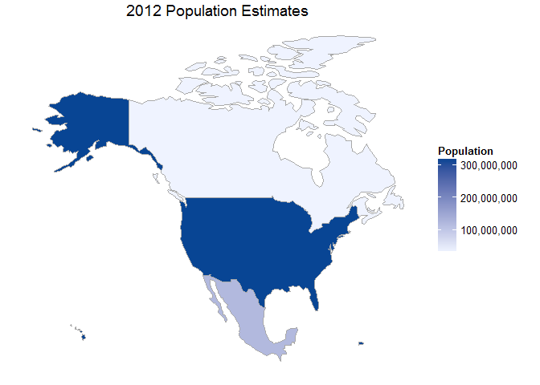
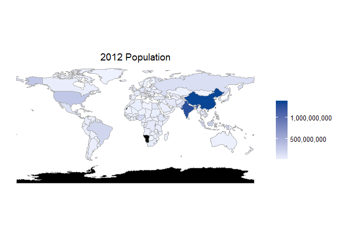
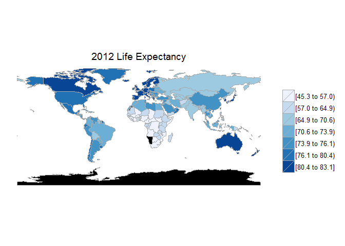

Introduction
------------

[`choroplethr`](https://cran.r-project.org/web/packages/choroplethr/index.html) -
Simplify the Creation of Choropleth Maps in R

Package by [Ari Lamstein](http://www.arilamstein.com/)

[`WDI`](https://cran.r-project.org/web/packages/WDI/index.html) - World
Development Indicators (World Bank)

The following relies heavily on the
[vignette](https://cran.r-project.org/web/packages/choroplethr/index.html)
of the `choroplethr`-package

What is a choropleth map
------------------------

A choropleth is a map which

-   shows geographic boundaries.
-   colors those regions based on some metric.

Choropleths are useful for visualizing data where geographic boundaries
are a natural unit of aggregation.

Population estimates for US States
----------------------------------

`df_pop_state` is a dataset which is included in the package
`choroplethr`, containing population estimates for US States in 2012.

<table>
<thead>
<tr class="header">
<th align="left">region</th>
<th align="right">value</th>
</tr>
</thead>
<tbody>
<tr class="odd">
<td align="left">alabama</td>
<td align="right">4777326</td>
</tr>
<tr class="even">
<td align="left">alaska</td>
<td align="right">711139</td>
</tr>
<tr class="odd">
<td align="left">arizona</td>
<td align="right">6410979</td>
</tr>
<tr class="even">
<td align="left">arkansas</td>
<td align="right">2916372</td>
</tr>
<tr class="odd">
<td align="left">california</td>
<td align="right">37325068</td>
</tr>
<tr class="even">
<td align="left">colorado</td>
<td align="right">5042853</td>
</tr>
<tr class="odd">
<td align="left">connecticut</td>
<td align="right">3572213</td>
</tr>
<tr class="even">
<td align="left">delaware</td>
<td align="right">900131</td>
</tr>
<tr class="odd">
<td align="left">district of columbia</td>
<td align="right">605759</td>
</tr>
<tr class="even">
<td align="left">florida</td>
<td align="right">18885152</td>
</tr>
<tr class="odd">
<td align="left">georgia</td>
<td align="right">9714569</td>
</tr>
<tr class="even">
<td align="left">hawaii</td>
<td align="right">1362730</td>
</tr>
<tr class="odd">
<td align="left">idaho</td>
<td align="right">1567803</td>
</tr>
<tr class="even">
<td align="left">illinois</td>
<td align="right">12823860</td>
</tr>
<tr class="odd">
<td align="left">indiana</td>
<td align="right">6485530</td>
</tr>
<tr class="even">
<td align="left">iowa</td>
<td align="right">3047646</td>
</tr>
<tr class="odd">
<td align="left">kansas</td>
<td align="right">2851183</td>
</tr>
<tr class="even">
<td align="left">kentucky</td>
<td align="right">4340167</td>
</tr>
<tr class="odd">
<td align="left">louisiana</td>
<td align="right">4529605</td>
</tr>
<tr class="even">
<td align="left">maine</td>
<td align="right">1329084</td>
</tr>
<tr class="odd">
<td align="left">maryland</td>
<td align="right">5785496</td>
</tr>
<tr class="even">
<td align="left">massachusetts</td>
<td align="right">6560595</td>
</tr>
<tr class="odd">
<td align="left">michigan</td>
<td align="right">9897264</td>
</tr>
<tr class="even">
<td align="left">minnesota</td>
<td align="right">5313081</td>
</tr>
<tr class="odd">
<td align="left">mississippi</td>
<td align="right">2967620</td>
</tr>
<tr class="even">
<td align="left">missouri</td>
<td align="right">5982413</td>
</tr>
<tr class="odd">
<td align="left">montana</td>
<td align="right">990785</td>
</tr>
<tr class="even">
<td align="left">nebraska</td>
<td align="right">1827306</td>
</tr>
<tr class="odd">
<td align="left">nevada</td>
<td align="right">2704204</td>
</tr>
<tr class="even">
<td align="left">new hampshire</td>
<td align="right">1317474</td>
</tr>
<tr class="odd">
<td align="left">new jersey</td>
<td align="right">8793888</td>
</tr>
<tr class="even">
<td align="left">new mexico</td>
<td align="right">2055287</td>
</tr>
<tr class="odd">
<td align="left">new york</td>
<td align="right">19398125</td>
</tr>
<tr class="even">
<td align="left">north carolina</td>
<td align="right">9544249</td>
</tr>
<tr class="odd">
<td align="left">north dakota</td>
<td align="right">676253</td>
</tr>
<tr class="even">
<td align="left">ohio</td>
<td align="right">11533561</td>
</tr>
<tr class="odd">
<td align="left">oklahoma</td>
<td align="right">3749005</td>
</tr>
<tr class="even">
<td align="left">oregon</td>
<td align="right">3836628</td>
</tr>
<tr class="odd">
<td align="left">pennsylvania</td>
<td align="right">12699589</td>
</tr>
<tr class="even">
<td align="left">rhode island</td>
<td align="right">1052471</td>
</tr>
<tr class="odd">
<td align="left">south carolina</td>
<td align="right">4630351</td>
</tr>
<tr class="even">
<td align="left">south dakota</td>
<td align="right">815871</td>
</tr>
<tr class="odd">
<td align="left">tennessee</td>
<td align="right">6353226</td>
</tr>
<tr class="even">
<td align="left">texas</td>
<td align="right">25208897</td>
</tr>
<tr class="odd">
<td align="left">utah</td>
<td align="right">2766233</td>
</tr>
<tr class="even">
<td align="left">vermont</td>
<td align="right">625498</td>
</tr>
<tr class="odd">
<td align="left">virginia</td>
<td align="right">8014955</td>
</tr>
<tr class="even">
<td align="left">washington</td>
<td align="right">6738714</td>
</tr>
<tr class="odd">
<td align="left">west virginia</td>
<td align="right">1850481</td>
</tr>
<tr class="even">
<td align="left">wisconsin</td>
<td align="right">5687219</td>
</tr>
<tr class="odd">
<td align="left">wyoming</td>
<td align="right">562803</td>
</tr>
</tbody>
</table>

`choroplethr` - Hello World
---------------------------

For example, here is a
[choropleth](http://mirrors.softliste.de/cran/web/packages/choroplethr/vignettes/a-introduction.html)
that shows 2012 US State Population Estimates:

We get a choropleth map with only one argument:

    state_choropleth(df_pop_state)

But we can also create a title and name the legend:

    state_choropleth(df_pop_state, title="2012 US State Population Estimates", legend="Population")

Show only three states
----------------------

[US State
Chropleths](http://mirrors.softliste.de/cran/web/packages/choroplethr/vignettes/b-state-choropleth.html)

    state_choropleth(df_pop_state,
                     title      = "2012 Population Estimates",
                     legend     = "Population",
                     num_colors = 1,
                     zoom       = c("california", "washington", "oregon"))

US County Chropleths
--------------------

[Choropleth of US
Counties](http://mirrors.softliste.de/cran/web/packages/choroplethr/vignettes/c-county-choropleth.html)

    ?df_pop_county

    ?county_choropleth

    data(df_pop_county)

    county_choropleth(df_pop_county)

[Country Choropleths](http://mirrors.softliste.de/cran/web/packages/choroplethr/vignettes/d-country-choropleth.html)
--------------------------------------------------------------------------------------------------------------------

    data(df_pop_country)

    country_choropleth(df_pop_country,
                     title      = "2012 Population Estimates",
                     legend     = "Population",
                     num_colors = 1,
                     zoom       = c("united states of america", "mexico", "canada"))

World Bank data
---------------

    library(choroplethr)
    library(WDI) 

    choroplethr_wdi(code="SP.POP.TOTL", year=2012, title="2012 Population", num_colors=1)

[Life Expectancy](http://mirrors.softliste.de/cran/web/packages/choroplethr/vignettes/f-world-bank-data.html)
-------------------------------------------------------------------------------------------------------------

    library(WDI) 
    choroplethr_wdi(code="SP.DYN.LE00.IN", year=2012, title="2012 Life Expectancy")

Animated
--------

    data(df_president_ts)

With the questionmark we get help

    ?df_president_ts

The datatable
-------------

-   [datatable](http://www.htmlwidgets.org/showcase_datatables.html)

Resources / Links
-----------------

-   [Intro - What is a
    choropleth](https://cran.r-project.org/web/packages/choroplethr/vignettes/a-introduction.html)

-   [Description](http://radar.oreilly.com/2014/01/new-choropleth-package-in-r.html)
    on the usage of the `choroplethr` package

-   Plot the [US
    states](https://cran.r-project.org/web/packages/choroplethr/vignettes/b-state-choropleth.html)
    with `choroplethr`

-   [Mapping World Bank
    Data](https://cran.r-project.org/web/packages/choroplethr/vignettes/f-world-bank-data.html)
    with `choroplethr`

-   [Revolutions-blog](http://blog.revolutionanalytics.com/2014/01/easy-data-maps-with-r-the-choroplethr-package-.html)
    on the `choroplethr` package

-   [trulia](http://www.trulia.com/tech/2014/01/15/the-choroplethr-package-for-r/)-blog
    on the `choroplethr` package

-   [Presentation Ari
    Lamstein](http://www.r-bloggers.com/slides-for-my-upcoming-talk-mapping-census-data-in-r/)
    on the `choroplethr` package
