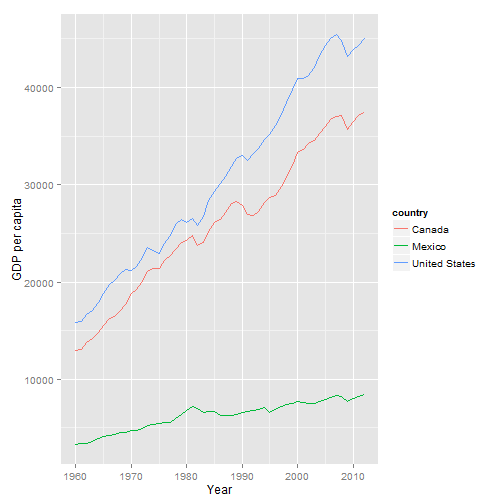
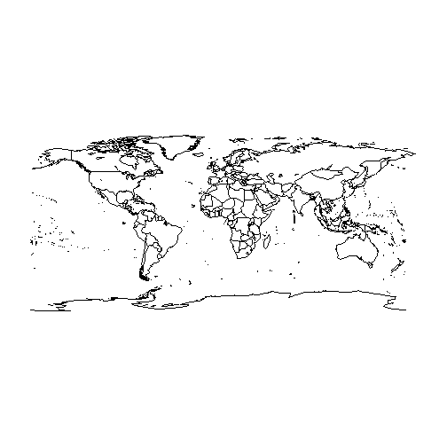

## Package `datasets`


```r
library(datasets)
data(quakes)
```


|    lat|   long| depth| mag| stations|
|------:|------:|-----:|---:|--------:|
| -20.42| 181.62|   562| 4.8|       41|
| -20.62| 181.03|   650| 4.2|       15|
| -26.00| 184.10|    42| 5.4|       43|
| -17.97| 181.66|   626| 4.1|       19|
| -20.42| 181.96|   649| 4.0|       11|
| -19.68| 184.31|   195| 4.0|       12|

## FIPS code

Federal Information Processing Standard ([FIPS](https://en.wikipedia.org/wiki/FIPS_county_code))


```r
library(maps)
```

```
## 
##  # ATTENTION: maps v3.0 has an updated 'world' map.        #
##  # Many country borders and names have changed since 1990. #
##  # Type '?world' or 'news(package="maps")'. See README_v3. #
```

```r
data(county.fips)
```


| fips|polyname        |
|----:|:---------------|
| 1001|alabama,autauga |
| 1003|alabama,baldwin |
| 1005|alabama,barbour |
| 1007|alabama,bibb    |
| 1009|alabama,blount  |
| 1011|alabama,bullock |


```r
library(UScensus2010)
```

```
## Loading required package: maptools
## Loading required package: sp
## Checking rgeos availability: TRUE
## Loading required package: foreign
## 
## 
## Package UScensus2010: US Census 2010 Suite of R Packages
## Version 0.11 created on 2011-11-18.
## 
## Zack Almquist, University of California-Irvine
## ne
## 
## For citation information, type citation("UScensus2010").
## Type help(package=UScensus2010) to get started.
```


## World Bank Data

[`WDI`](https://cran.r-project.org/web/packages/WDI/index.html) - World Development Indicators (World Bank)
- [Explanation for package](https://github.com/vincentarelbundock/WDI)


```r
library(WDI)
```


```r
WDIsearch('gdp')[1:10,]
```


|indicator            |name                                                                     |
|:--------------------|:------------------------------------------------------------------------|
|BG.GSR.NFSV.GD.ZS    |Trade in services (% of GDP)                                             |
|BM.KLT.DINV.GD.ZS    |Foreign direct investment, net outflows (% of GDP)                       |
|BN.CAB.XOKA.GD.ZS    |Current account balance (% of GDP)                                       |
|BN.CUR.GDPM.ZS       |Current account balance excluding net official capital grants (% of GDP) |
|BN.GSR.FCTY.CD.ZS    |Net income (% of GDP)                                                    |
|BN.KLT.DINV.CD.ZS    |Foreign direct investment (% of GDP)                                     |
|BN.KLT.PRVT.GD.ZS    |Private capital flows, total (% of GDP)                                  |
|BN.TRF.CURR.CD.ZS    |Net current transfers (% of GDP)                                         |
|BNCABFUNDCD_         |Current Account Balance, %GDP                                            |
|BX.KLT.DINV.WD.GD.ZS |Foreign direct investment, net inflows (% of GDP)                        |


## Download and use WDI data


```r
dat <-  WDI(indicator='NY.GDP.PCAP.KD', country=c('MX','CA','US'), start=1960, end=2012)
head(dat)
```

```
##   iso2c country NY.GDP.PCAP.KD year
## 1    CA  Canada       37442.33 2012
## 2    CA  Canada       37176.16 2011
## 3    CA  Canada       36465.71 2010
## 4    CA  Canada       35670.58 2009
## 5    CA  Canada       37086.90 2008
## 6    CA  Canada       37054.88 2007
```


|iso2c |country       | NY.GDP.PCAP.KD| year|
|:-----|:-------------|--------------:|----:|
|CA    |Canada        |      37442.329| 2012|
|CA    |Canada        |      37176.156| 2011|
|CA    |Canada        |      36465.711| 2010|
|CA    |Canada        |      35670.581| 2009|
|CA    |Canada        |      37086.898| 2008|
|CA    |Canada        |      37054.879| 2007|
|CA    |Canada        |      36679.368| 2006|
|CA    |Canada        |      36028.232| 2005|
|CA    |Canada        |      35269.571| 2004|
|CA    |Canada        |      34540.604| 2003|
|CA    |Canada        |      34227.441| 2002|
|CA    |Canada        |      33594.611| 2001|
|CA    |Canada        |      33372.029| 2000|
|CA    |Canada        |      32027.215| 1999|
|CA    |Canada        |      30756.325| 1998|
|CA    |Canada        |      29790.909| 1997|
|CA    |Canada        |      28879.144| 1996|
|CA    |Canada        |      28709.691| 1995|
|CA    |Canada        |      28176.819| 1994|
|CA    |Canada        |      27209.835| 1993|
|CA    |Canada        |      26810.195| 1992|
|CA    |Canada        |      26911.373| 1991|
|CA    |Canada        |      27870.938| 1990|
|CA    |Canada        |      28253.897| 1989|
|CA    |Canada        |      28094.961| 1988|
|CA    |Canada        |      27172.689| 1987|
|CA    |Canada        |      26461.819| 1986|
|CA    |Canada        |      26154.158| 1985|
|CA    |Canada        |      25218.352| 1984|
|CA    |Canada        |      24118.222| 1983|
|CA    |Canada        |      23751.812| 1982|
|CA    |Canada        |      24788.565| 1981|
|CA    |Canada        |      24248.551| 1980|
|CA    |Canada        |      24044.198| 1979|
|CA    |Canada        |      23395.114| 1978|
|CA    |Canada        |      22732.326| 1977|
|CA    |Canada        |      22232.201| 1976|
|CA    |Canada        |      21414.775| 1975|
|CA    |Canada        |      21433.011| 1974|
|CA    |Canada        |      21044.017| 1973|
|CA    |Canada        |      20010.032| 1972|
|CA    |Canada        |      19281.767| 1971|
|CA    |Canada        |      18798.454| 1970|
|CA    |Canada        |      17707.013| 1969|
|CA    |Canada        |      17052.474| 1968|
|CA    |Canada        |      16458.308| 1967|
|CA    |Canada        |      16282.448| 1966|
|CA    |Canada        |      15563.736| 1965|
|CA    |Canada        |      14861.726| 1964|
|CA    |Canada        |      14193.732| 1963|
|CA    |Canada        |      13748.215| 1962|
|CA    |Canada        |      13075.738| 1961|
|CA    |Canada        |      12930.990| 1960|
|MX    |Mexico        |       8448.803| 2012|
|MX    |Mexico        |       8238.388| 2011|
|MX    |Mexico        |       8034.797| 2010|
|MX    |Mexico        |       7762.079| 2009|
|MX    |Mexico        |       8275.465| 2008|
|MX    |Mexico        |       8293.439| 2007|
|MX    |Mexico        |       8167.108| 2006|
|MX    |Mexico        |       7893.968| 2005|
|MX    |Mexico        |       7767.080| 2004|
|MX    |Mexico        |       7542.581| 2003|
|MX    |Mexico        |       7529.063| 2002|
|MX    |Mexico        |       7615.711| 2001|
|MX    |Mexico        |       7768.752| 2000|
|MX    |Mexico        |       7490.326| 1999|
|MX    |Mexico        |       7415.420| 1998|
|MX    |Mexico        |       7205.835| 1997|
|MX    |Mexico        |       6858.923| 1996|
|MX    |Mexico        |       6598.725| 1995|
|MX    |Mexico        |       7135.184| 1994|
|MX    |Mexico        |       6946.280| 1993|
|MX    |Mexico        |       6808.290| 1992|
|MX    |Mexico        |       6702.484| 1991|
|MX    |Mexico        |       6561.497| 1990|
|MX    |Mexico        |       6372.094| 1989|
|MX    |Mexico        |       6240.192| 1988|
|MX    |Mexico        |       6289.809| 1987|
|MX    |Mexico        |       6302.851| 1986|
|MX    |Mexico        |       6685.614| 1985|
|MX    |Mexico        |       6654.434| 1984|
|MX    |Mexico        |       6560.130| 1983|
|MX    |Mexico        |       6997.107| 1982|
|MX    |Mexico        |       7199.835| 1981|
|MX    |Mexico        |       6773.804| 1980|
|MX    |Mexico        |       6351.700| 1979|
|MX    |Mexico        |       5935.991| 1978|
|MX    |Mexico        |       5590.946| 1977|
|MX    |Mexico        |       5555.919| 1976|
|MX    |Mexico        |       5473.638| 1975|
|MX    |Mexico        |       5332.381| 1974|
|MX    |Mexico        |       5200.197| 1973|
|MX    |Mexico        |       4977.897| 1972|
|MX    |Mexico        |       4750.159| 1971|
|MX    |Mexico        |       4726.585| 1970|
|MX    |Mexico        |       4579.422| 1969|
|MX    |Mexico        |       4566.565| 1968|
|MX    |Mexico        |       4302.124| 1967|
|MX    |Mexico        |       4189.475| 1966|
|MX    |Mexico        |       4071.572| 1965|
|MX    |Mexico        |       3921.051| 1964|
|MX    |Mexico        |       3614.542| 1963|
|MX    |Mexico        |       3449.618| 1962|
|MX    |Mexico        |       3400.922| 1961|
|MX    |Mexico        |       3342.488| 1960|
|US    |United States |      45008.614| 2012|
|US    |United States |      44324.944| 2011|
|US    |United States |      43961.169| 2010|
|US    |United States |      43235.559| 2009|
|US    |United States |      44861.391| 2008|
|US    |United States |      45420.187| 2007|
|US    |United States |      45052.921| 2006|
|US    |United States |      44307.921| 2005|
|US    |United States |      43270.702| 2004|
|US    |United States |      42079.984| 2003|
|US    |United States |      41284.451| 2002|
|US    |United States |      40938.063| 2001|
|US    |United States |      40945.634| 2000|
|US    |United States |      39776.101| 1999|
|US    |United States |      38434.753| 1998|
|US    |United States |      37228.767| 1997|
|US    |United States |      36061.615| 1996|
|US    |United States |      35149.387| 1995|
|US    |United States |      34628.880| 1994|
|US    |United States |      33695.617| 1993|
|US    |United States |      33230.459| 1992|
|US    |United States |      32537.699| 1991|
|US    |United States |      32999.838| 1990|
|US    |United States |      32746.226| 1989|
|US    |United States |      31883.454| 1988|
|US    |United States |      30876.253| 1987|
|US    |United States |      30111.102| 1986|
|US    |United States |      29359.653| 1985|
|US    |United States |      28416.486| 1984|
|US    |United States |      26723.680| 1983|
|US    |United States |      25775.158| 1982|
|US    |United States |      26529.000| 1981|
|US    |United States |      26113.118| 1980|
|US    |United States |      26429.565| 1979|
|US    |United States |      25900.321| 1978|
|US    |United States |      24797.104| 1977|
|US    |United States |      23944.261| 1976|
|US    |United States |      22937.441| 1975|
|US    |United States |      23210.572| 1974|
|US    |United States |      23545.372| 1973|
|US    |United States |      22501.433| 1972|
|US    |United States |      21606.419| 1971|
|US    |United States |      21183.210| 1970|
|US    |United States |      21339.811| 1969|
|US    |United States |      20893.611| 1968|
|US    |United States |      20114.276| 1967|
|US    |United States |      19791.341| 1966|
|US    |United States |      18783.348| 1965|
|US    |United States |      17859.998| 1964|
|US    |United States |      17122.002| 1963|
|US    |United States |      16644.442| 1962|
|US    |United States |      15928.499| 1961|
|US    |United States |      15791.862| 1960|

## First plot of downloaded WDI data

 


## OpenStreetMap

> OpenStreetMap (OSM) is a collaborative project to create a free editable map of the world.

[Wikipedia - OpenStreetMap](https://en.wikipedia.org/wiki/OpenStreetMap)

## Data from Open Street Map


```r
library(osmar)
api <- osmsource_api()
library(ggmap)
```

## Download OSM data 


```r
cityC <- geocode("Berlin",source="google")
```

```
## Information from URL : http://maps.googleapis.com/maps/api/geocode/json?address=Berlin&sensor=false
```

```r
bb <- center_bbox(cityC$lon,cityC$lat,1000, 1000)
uaBerlin <- get_osm(bb, source = api)
```

## TwittR


```r
library(twitteR)
library(streamR)
```


<http://www.r-bloggers.com/mapping-the-world-with-tweets-including-a-gif-without-cats-and-a-shiny-app/>

## The worldHires data


```r
library(mapdata)
data(worldHiresMapEnv)
map('worldHires', col=1:10)
```

 


## Historic data

[Historic geocoder](http://www.azavea.com/blogs/newsletter/v2i3/azavea-research-historic-geocoder/)

- [package HistData](http://www.inside-r.org/packages/cran/HistData)


```r
library(HistData)
data(Arbuthnot)
```

## Environmental data

- [National climatic data center](http://www.ncdc.noaa.gov/ibtracs/index.php?name=ibtracs-data)

## Data for the US


```r
library(UScensus2000)
```

## GDELT data

- [GDELT](http://www.gdeltproject.org/)
- [Kalev Leetaru](http://www.kalevleetaru.com/)
- [Example on usage of GDELT data](http://quantifyingmemory.blogspot.de/2013/04/mapping-gdelt-data-in-r-and-some.html)


```r
library(GDELTtools)
test.filter <- list(ActionGeo_ADM1Code=c("NI", "US"), ActionGeo_CountryCode="US")
test.results <- GetGDELT(start.date="1979-01-01", end.date="1979-12-31",
                         filter=test.filter)
```


## [The US airports and flight routes](http://www.sasanalysis.com/2013/06/the-us-airports-with-most-flight-routes.html)

- More data [here](http://openflights.org/data.html)


```r
link1 <- "http://openflights.svn.sourceforge.net/viewvc/openflights/
openflights/data/airports.dat"
airport <- read.csv(link1, header = F)

link2 <- "http://openflights.svn.sourceforge.net/viewvc/openflights/
openflights/data/routes.dat"
route <- read.csv(link2, header = F)
```

## Data on harbours

- [Natural earth data](http://www.naturalearthdata.com/downloads/10m-cultural-vectors/)

- [Make maps with that data](http://www.r-bloggers.com/minimalist-maps/)

## Other data sources

- [Census results - Germany](https://ergebnisse.zensus2011.de/)
- [Census results - Britain](http://www.r-bloggers.com/2011-census-open-atlas-project/) and [boundaries](http://www.ons.gov.uk/ons/guide-method/census/2011/census-data/2011-census-prospectus/new-developments-for-2011-census-results/2011-census-geography/2011-census-geography-prospectus/index.html)
- [Data on airports](http://openflights.org/data.html) and an [example](http://www.milanor.net/blog/?p=594) on the usage in R


## [ADFC/opengeodb](http://www.fa-technik.adfc.de/code/opengeodb/)

Bicycle Coding


```r
link <- "http://www.fa-technik.adfc.de/code/opengeodb/DE9.tab"
info <- read.csv(link,sep="\t",header=F)
```


## Data portal

[okfn](http://data.okfn.org/)

[enigma](https://app.enigma.io/table/org.worldbank.hnp.data)

## Amazon Web Services

[AWS](http://aws.amazon.com/de/public-data-sets/) 


## Further resources

- [OpenGov](http://ropengov.github.io/projects/)

- [metro extracts - City-sized portions of OpenStreetMap](https://mapzen.com/data/metro-extracts/)

- [A list of potential data sources](http://wiki.openstreetmap.org/wiki/Potential_Datasources)

- [ICEDS European Data Server](http://geocommons.com/overlays/96341)

- [Datasources Germany](http://wiki.openstreetmap.org/wiki/DE:Potential_Datasources)

- [openaprs](http://www.openaprs.net/)

- [SALB](http://wiki.openstreetmap.org/wiki/SALB)

- [OpenCellID](http://opencellid.org/)

- [Data on CO2 emmissions](http://databank.worldbank.org/data/reports.aspx?source=2&country=DEU&series=&period=)

- [New York data](https://data.cityofnewyork.us/)

- [Example New York data](https://data.cityofnewyork.us/City-Government/Parking-Violations-Issued-Fiscal-Year-2014-August-/jt7v-77mi)
