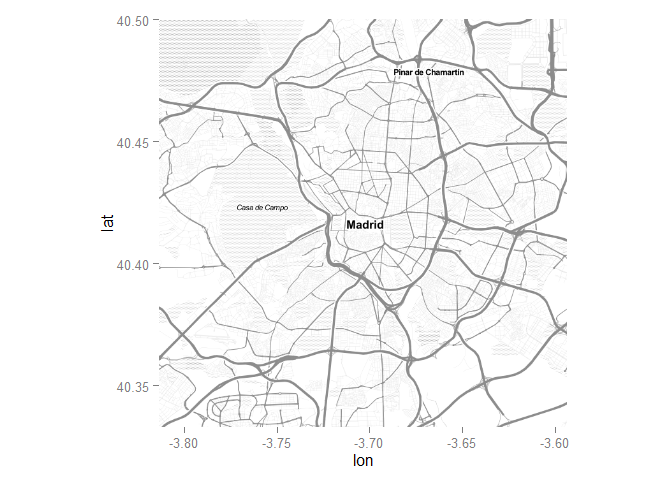
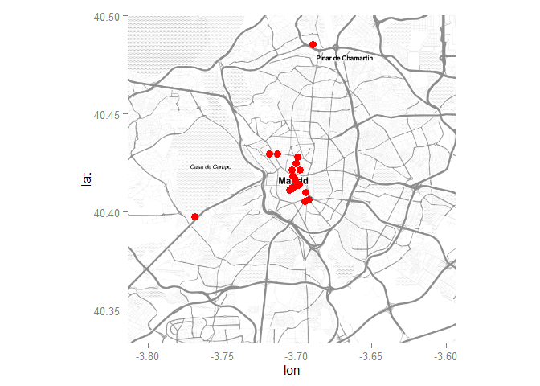
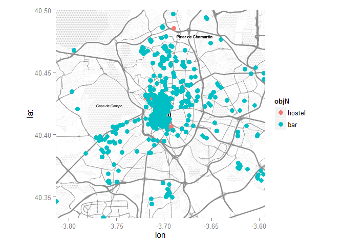
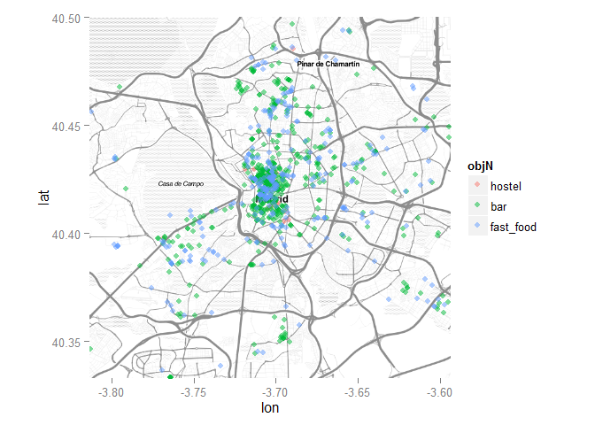

Backpacking Routes
------------------

[Source](http://www.indietraveller.co/map-of-where-to-go-backpacking/)

The geosmdata2 package
----------------------

    library(devtools)
    # devtools::install_github("Japhilko/GeoData/geosmdata2")
    library(geosmdata2)

    ## Loading required package: rjson
    ## Loading required package: RCurl
    ## Loading required package: bitops
    ## Loading required package: stringr
    ## Loading required package: XML

Download Information from OpenStreetMap
---------------------------------------

[OSM map features](http://wiki.openstreetmap.org/wiki/Map_Features)

    place <- "Madrid"
    object <- "hostel"
    obj <- get_osm_nodes(object,place)

Extract information
-------------------

The following function extracts the tagged information

    op <- extract_info_op(obj,object)

    github.path <- "C:/Users/kolbjp/Documents/GitHub/GeoData/2015/data"
    setwd(github.path)
    Hostels_Madrid <- op
    write.csv(Hostels_Madrid,file="Hostels_Madrid.csv")

Data Overview
-------------

    colnames(op)

    ##  [1] "created_by"             "name"                  
    ##  [3] "phone"                  "tourism"               
    ##  [5] "website"                "stars"                 
    ##  [7] "operator"               "beds"                  
    ##  [9] "wheelchair"             "addr.city"             
    ## [11] "addr.housenumber"       "addr.postcode"         
    ## [13] "addr.street"            "contact.email"         
    ## [15] "contact.phone"          "contact.website"       
    ## [17] "source"                 "addr.country"          
    ## [19] "internet_access"        "internet_access.fee"   
    ## [21] "smoking"                "email"                 
    ## [23] "fax"                    "amenity"               
    ## [25] "name.en"                "name.es"               
    ## [27] "wheelchair.description" "contact.facebook"      
    ## [29] "lat"                    "lon"

Dat Overview II
---------------

<table>
<thead>
<tr class="header">
<th align="left"></th>
<th align="left">name</th>
<th align="right">lat</th>
<th align="right">lon</th>
</tr>
</thead>
<tbody>
<tr class="odd">
<td align="left">151223418</td>
<td align="left">Pensión &quot;Mónica&quot;</td>
<td align="right">40.48558</td>
<td align="right">-3.689666</td>
</tr>
<tr class="even">
<td align="left">286312700</td>
<td align="left">Albergue Juvenil</td>
<td align="right">40.57956</td>
<td align="right">-4.146794</td>
</tr>
<tr class="odd">
<td align="left">621118487</td>
<td align="left">La Hospedería de Antonia</td>
<td align="right">40.53325</td>
<td align="right">-3.479968</td>
</tr>
<tr class="even">
<td align="left">1013493190</td>
<td align="left">Alaska</td>
<td align="right">41.04626</td>
<td align="right">-3.616569</td>
</tr>
<tr class="odd">
<td align="left">1572572830</td>
<td align="left">NA</td>
<td align="right">40.41260</td>
<td align="right">-3.703268</td>
</tr>
<tr class="even">
<td align="left">1743983862</td>
<td align="left">Ballesta</td>
<td align="right">40.42154</td>
<td align="right">-3.703579</td>
</tr>
<tr class="odd">
<td align="left">1819460987</td>
<td align="left">Acogida de Peregrino Cercedilla</td>
<td align="right">40.74145</td>
<td align="right">-4.048094</td>
</tr>
<tr class="even">
<td align="left">1828865799</td>
<td align="left">Albergue de Peregrinos Tres Cantos</td>
<td align="right">40.59934</td>
<td align="right">-3.712279</td>
</tr>
<tr class="odd">
<td align="left">1937730956</td>
<td align="left">Albergue juvenil Santa Cruz de Marcenado</td>
<td align="right">40.42984</td>
<td align="right">-3.713269</td>
</tr>
<tr class="even">
<td align="left">1987703776</td>
<td align="left">Hostal Longinos El Aribel</td>
<td align="right">40.73814</td>
<td align="right">-4.066391</td>
</tr>
<tr class="odd">
<td align="left">2043171005</td>
<td align="left">Apartahotel Rosales</td>
<td align="right">40.42973</td>
<td align="right">-3.718641</td>
</tr>
<tr class="even">
<td align="left">2043576532</td>
<td align="left">Hostal Argentina</td>
<td align="right">40.40624</td>
<td align="right">-3.692166</td>
</tr>
<tr class="odd">
<td align="left">2078129743</td>
<td align="left">Hostal Cartagena</td>
<td align="right">40.40559</td>
<td align="right">-3.694818</td>
</tr>
<tr class="even">
<td align="left">2087632261</td>
<td align="left">El Refugio de la Sauca</td>
<td align="right">40.91877</td>
<td align="right">-3.842104</td>
</tr>
<tr class="odd">
<td align="left">2087671151</td>
<td align="left">El Pajar de Alameda</td>
<td align="right">40.92009</td>
<td align="right">-3.843968</td>
</tr>
<tr class="even">
<td align="left">2134238034</td>
<td align="left">Hostal Vilches</td>
<td align="right">40.55210</td>
<td align="right">-3.376819</td>
</tr>
<tr class="odd">
<td align="left">2134285295</td>
<td align="left">Hostal La Posada del Diablo</td>
<td align="right">40.48070</td>
<td align="right">-3.373004</td>
</tr>
<tr class="even">
<td align="left">2134285297</td>
<td align="left">Hostal Torero</td>
<td align="right">40.48078</td>
<td align="right">-3.374042</td>
</tr>
<tr class="odd">
<td align="left">2139528583</td>
<td align="left">Hostal Goyma</td>
<td align="right">40.42410</td>
<td align="right">-3.533989</td>
</tr>
<tr class="even">
<td align="left">2140419461</td>
<td align="left">Hostal Castilla</td>
<td align="right">40.02959</td>
<td align="right">-3.605549</td>
</tr>
<tr class="odd">
<td align="left">2149177125</td>
<td align="left">NA</td>
<td align="right">40.62999</td>
<td align="right">-4.020543</td>
</tr>
<tr class="even">
<td align="left">2246112891</td>
<td align="left">Las Musas</td>
<td align="right">40.41147</td>
<td align="right">-3.704066</td>
</tr>
<tr class="odd">
<td align="left">2334279953</td>
<td align="left">Hierba buena</td>
<td align="right">40.39787</td>
<td align="right">-3.768387</td>
</tr>
<tr class="even">
<td align="left">2386535331</td>
<td align="left">Hostal Rural El Cańo</td>
<td align="right">40.66069</td>
<td align="right">-4.022586</td>
</tr>
<tr class="odd">
<td align="left">2388718988</td>
<td align="left">Hostal Era</td>
<td align="right">40.42488</td>
<td align="right">-3.700637</td>
</tr>
<tr class="even">
<td align="left">2546770612</td>
<td align="left">Hostal San Blas</td>
<td align="right">40.41013</td>
<td align="right">-3.694123</td>
</tr>
<tr class="odd">
<td align="left">2577045957</td>
<td align="left">San Antonio</td>
<td align="right">40.41403</td>
<td align="right">-3.698781</td>
</tr>
<tr class="even">
<td align="left">2694323129</td>
<td align="left">La Posada de Huertas</td>
<td align="right">40.41376</td>
<td align="right">-3.699324</td>
</tr>
<tr class="odd">
<td align="left">2989030233</td>
<td align="left">Cat's Hostel</td>
<td align="right">40.41293</td>
<td align="right">-3.701754</td>
</tr>
<tr class="even">
<td align="left">3034491752</td>
<td align="left">Hospedería Nerea</td>
<td align="right">40.42836</td>
<td align="right">-3.536723</td>
</tr>
<tr class="odd">
<td align="left">3034491753</td>
<td align="left">Hostal Sanfer</td>
<td align="right">40.42882</td>
<td align="right">-3.536948</td>
</tr>
<tr class="even">
<td align="left">3283874766</td>
<td align="left">Tirso de Molina Hostel</td>
<td align="right">40.41135</td>
<td align="right">-3.704986</td>
</tr>
<tr class="odd">
<td align="left">3374152199</td>
<td align="left">Albergue juvenil. Mejía Lequerica</td>
<td align="right">40.42812</td>
<td align="right">-3.699539</td>
</tr>
<tr class="even">
<td align="left">3381180433</td>
<td align="left">San Juan Hostel</td>
<td align="right">40.41824</td>
<td align="right">-3.702718</td>
</tr>
<tr class="odd">
<td align="left">3495677022</td>
<td align="left">Campamento Sierra Norte Juvenocio</td>
<td align="right">40.96368</td>
<td align="right">-3.583046</td>
</tr>
<tr class="even">
<td align="left">3495733195</td>
<td align="left">Alojamientos rurales El Bulin</td>
<td align="right">41.00689</td>
<td align="right">-3.559823</td>
</tr>
<tr class="odd">
<td align="left">3497154851</td>
<td align="left">Alojamiento Las Runas</td>
<td align="right">40.98833</td>
<td align="right">-3.538524</td>
</tr>
<tr class="even">
<td align="left">3497154855</td>
<td align="left">Posada Peñaparda</td>
<td align="right">40.98983</td>
<td align="right">-3.536853</td>
</tr>
<tr class="odd">
<td align="left">3522056580</td>
<td align="left">Albergue Municipal</td>
<td align="right">40.92291</td>
<td align="right">-3.530093</td>
</tr>
<tr class="even">
<td align="left">3522056587</td>
<td align="left">Hostal El Lago</td>
<td align="right">40.92179</td>
<td align="right">-3.530376</td>
</tr>
<tr class="odd">
<td align="left">3577159293</td>
<td align="left">Esmeralda</td>
<td align="right">40.41645</td>
<td align="right">-3.701569</td>
</tr>
<tr class="even">
<td align="left">3641468947</td>
<td align="left">Hosal Zoraya</td>
<td align="right">40.44934</td>
<td align="right">-3.567813</td>
</tr>
<tr class="odd">
<td align="left">3682163460</td>
<td align="left">Barbieri International Hostel</td>
<td align="right">40.42158</td>
<td align="right">-3.698080</td>
</tr>
<tr class="even">
<td align="left">3788924249</td>
<td align="left">NA</td>
<td align="right">40.67054</td>
<td align="right">-4.086224</td>
</tr>
</tbody>
</table>

Get a map
---------

    library(ggmap)
    place_map12stamen <- qmap(place, zoom = 12,
                              maptype="toner-lite",
                              source="stamen")
    place_map12stamen

Plot results
------------

    place_map12stamen + geom_point(aes(x = lon, y = lat),
                           data = op,size=3,col="red") 

Get other points of interest
----------------------------

    place <- "Madrid"
    object <- "bar"
    obj <- get_osm_nodes(object,place)
    op2 <- extract_info_op(obj,object)

Combine data
------------

    op_df1 <- data.frame(op[,c("lat","lon")],objN="hostel")
    op_df2 <-data.frame(op2[,c("lat","lon")],objN="bar")

    op_df <- rbind(op_df1,op_df2)

    place_map12stamen + geom_point(aes(x = lon, y = lat,col=objN),
                           data = op_df,size=3) 

Add more Information
--------------------

Where to get some fast food

    place_map12stamen + geom_point(aes(x = lon, y = lat,col=objN),
                           data = op_df,size=2,alpha=.5) 

